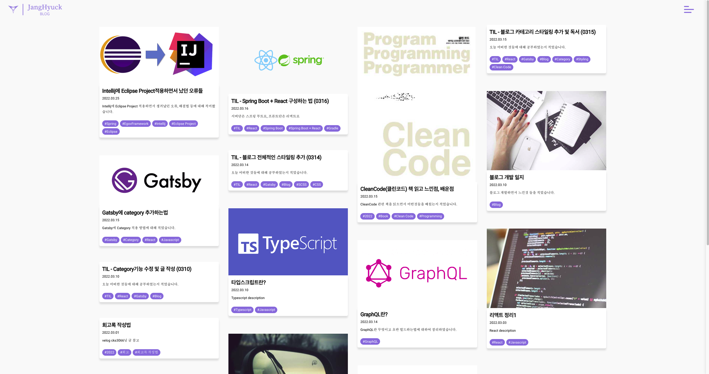

# JH's BLOG

---

## 만들게 된 계기
친구가 vue를 활용해 .md 파일을 사용하여 개인 블로그를 만들면서 자신이 한 것들을 정리하는 모습을 보고
나도 만들까 고민은 했지만 그 당시에는 리액트 공부 초기라 다음에 하기로 하고 미뤘다.  
2~3주 뒤 쯤 카페에서 회사분들이랑 개인 블로그 관련 얘기가 나오고 지금 이정도면 나도 만들수 있겠다 싶어서 만들게 되었다.

---

## 기술 스택
- 도메인 생성 및 빌드 / Netlify
- 정적 페이지 생성 / Gatsby Framework
- 템플릿 / Gatsby Starter Apple
- .md 데이터 가져오기 / GraphQL
- 주 사용 언어 / React Library
- Html styling / css, sass(scss)
- GitHub

---

## IDE
- IntelliJ IDEA Ultimate / version: 2022.02

---

## 디자인 변경 이력

#### 이전 디자인

처음 Gatsby를 활용해 커스텀으로 이것저것 만져보며 만들었던 초창기 블로그 디자인이다.
 - Masonry Layout 적용
 - tag 기능 적용
 - 카테고리 별로 자동 메뉴 추가 기능 적용

#### 현재 디자인

Gatsby 템플릿 중 **Gatsby Starter Apple**를 사용하여 만들었다.
지금은 템플릿을 적용하고 이것저것 내 입맛에 맞게 조금씩 변경 중이다.
역시 템플릿을 사용하는게 편하기도 하고 깔끔하다.  
추후에 시간이 된다면 직접 템플릿도 만들어 보고 싶다.
