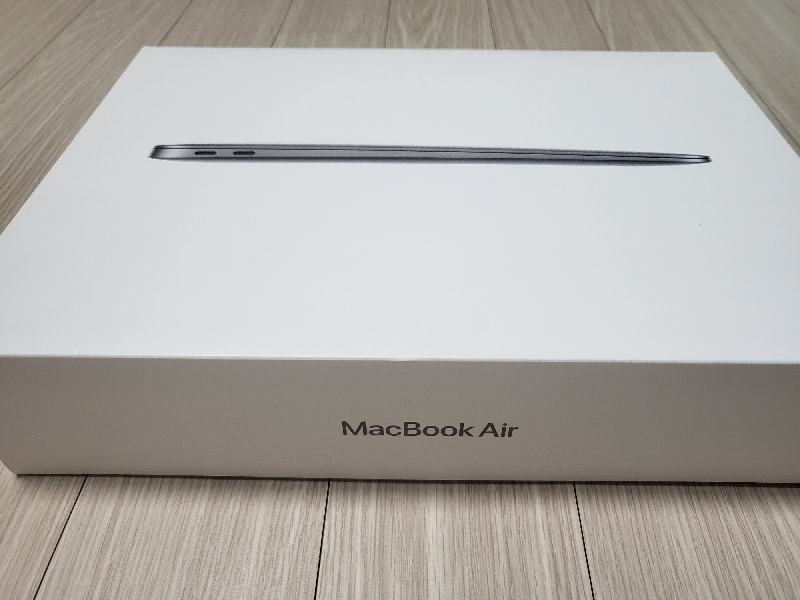

8월 2일 기준으로 주문했던 Macbook Air가 드디어 왔다!!

항상 유튜브로만 봐오던것을 직접 보니 두근두근거렸다.

## 구매한 Macbook Air 옵션

**SSD(저장용량):** 256GB  
**RAM:** 16GB ( 개발자 기준으로 다들 RAM만큼은 업글 하는것을 추천했다. )

## Macbook Air 구매 이유

**첫 번째 이유는 React Native를 활용한 앱 개발**을 공부 도중에 ios쪽 테스트 및 추 후 앱 개발을 위해서 구매했다.
윈도우 쪽에서도 하려면 할 수는 있긴 했다. ( 가상머신 프로그램을 활용해서 )
이 방법으로 시도는 해 보았으나 여간 귀찮은게 아니였다. 세팅부터 해서 렉 줄이는 방법까지 힘들어서 하다가 포기했다.  

**두 번째 이유는 다 핑계고 예전부터 맥북을 사서 써보고 싶었다.** ㅎㅎ  
기존에 쓰던 LG그램 16 을 처분하고 생에 처음으로 제대로 맥을 써보기로 했다.

## 초기세팅
초반에 애플 계정 로그인하고 빅스비며 키보드 설정이며 이런것은 어렵지 않게 할 수 있었다.
그리고 메신저앱 (카카오톡, slack, jandi 등) 설치하고, 개발에 필요한 프로그램들( intellij, xcode, android studio 등 )을 다운 받았다.
( 기분탓인지는 모르겠지만. 카카오톡도 그렇고 다른 프로그램들도 그렇고 윈도우보다 갬성이 있는 거 같다. )

---

## Android Studio 및 Java사용을 위한 설정

React Native를 책을 보고 공부 중인데, 이 책에서는 Homebrew를 사용해 jdk를 다운 받았다.

[안드로이드 스튜디오 설치 및 자바 설치](/blog/development/Programming-language/Java/androidStudioSetting/)

※ 추후 React-native 세팅 및 실행기 올릴 예정이다.

