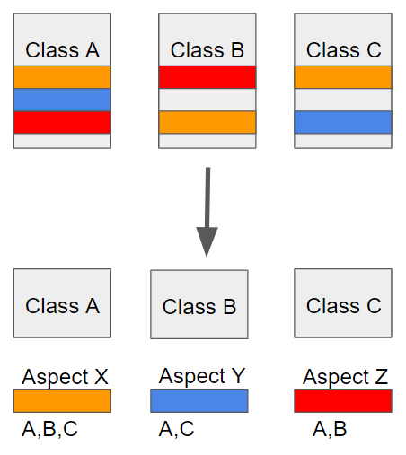

## AOP 정의
AOP는 **Aspect Oriented Programming**의 약자로, 관점 지향 프로그래밍이라는 뜻을 가지고 있다.  
여러 모듈에서 **공통으로 사용되는 관심사를 따로 모아 모듈화** 하고, 이를 필요로 하는 **부분에 적용**하는 기술이라고 알고 있다.

출처: https://engkimbs.tistory.com/746  
  
위의 사진을 보면,  
주황색은 Class A / B / C 모든곳에서 사용되고,  
빨강색은 Class A / B 에서,  
파랑색은 Class A / C 에서 사용된다.  
  
수정이 일어날 때마다 모든 곳에서 수정하는것은 비효율적이고, 유지보수측에서도 좋지 않기 떄문에,  
공용으로 사용할 모듈을 만들기 위해 사용하는것이 AOP다.
  
## AOP의 주요 개념

### Aspect ( Advice + PointCut )

Aspect는 **부가기능을 정의한** Advice 그리고 **Advice를 어디에 적용할 지 결정하는** PointCut의 합성어로, 현재로서는,  
이 어노테이션을 사용 시 해당 클래스를 AOP 클래스로서 사용하겠다고 알리는거라고 알면 될 듯 하다.

### Target
Aspect를 적용하는 곳 ( Class or Method ... )

### Advice
실질적으로 어떤 일을 해야할 지에 대한 것, 실질적인 부가기능을 담은 구현체

### JoinPoint
메서드 실행 전 / 후 / 주변, 에러 발생할 때 등에 끼워 넣을 수 있는 지점에 대한 정보를 가지고 있는 객체다.  
일반적으로 실행 중인 메서드의 이름, 메서드에 전달되는 매개 변수, 메서드가 호출되는 개체 및 기타 상황별 정보와 같은 정보가 포함된다.

### PointCut
`JoinPoint`의 상세한 스펙을 정의한 것이다.  
더욱 구체적으로 `Advice`가 실행될 지점을 정할 수 있다.

## AOP와 공통 관리 클래스의 차이점
처음에는 굳이 AOP를 쓰기보다, 특정 기능을 묶어둔 클래스나 메서드를 만들어서 사용하면 되지 않을까 생각했다.  
하지만 AOP의 개념을 알게 되고나서, 약간은 바뀌게 되었다.  

### 실행 시점 지정
먼저 특정 기능을 묶어든 클래스나 메서드의 경우, 기능은 모듈화가 가능하지만 실행 시점까지 공용으로 지정하긴 어렵다고 생각한다. 
해당 기능을 실행하는 시점까지 일일이 지정해줘야 사용할 수 있기 때문이다.  
하지만 AOP의 경우 PointCut으로 실행 시점을 지정할 수 있다.

## 스프링 AOP
프록시 패턴 기반의 AOP 구현체다.  

> <a href="/blog/development/Programming-language/Java/Study/CustomAnnotation/">프록시 패턴이란??</a>

※ 스프링 빈에만 AOP적용이 가능하다.

### 목적
모든 AOP 기능을 제공하는 것이 아닌, 스프링 IOC와 연동하여 엔터프라이즈 애플리케이션에서 가장 흔한 문제  
(중복코드, 프록시 클래스 작성의 번거로움, 객체들 간 관계 복잡도 증가 ...)등에 대한 해결책을 지원하는 것이다.

## 실습
<a href="/blog/development/Programming-language/Java/Study/CustomAnnotation/">Custom Annotation 만들어보기</a> 페이지의 `Spring Boot에서 Custom Annotation을 활용하는 방법`( 하단에 있음 )에
Spring Boot를 활용한 예제를 적어두었다.
