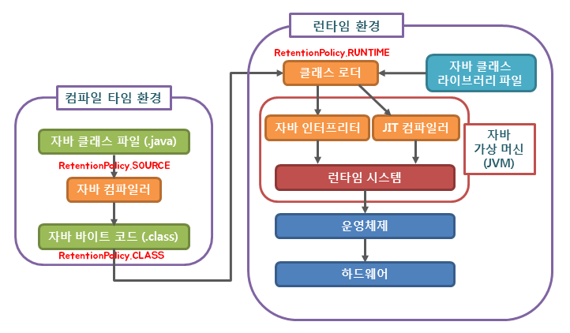

## 목차
 - Annotation 이란?
 - Annotation 생성
 - Annotation 사용
 - Annotation 활용 ( 리플렉션 )
 - Spring Boot에서 Custom Annotation을 활용하는 방법

## Annotation 이란?

먼저 위키백과에 따르면,
> - 사전적 의미로는 **"주석"** 이라는 뜻을 가지고 있다.  
> - 자바 애너테이션(Java Annotation)은 자바 소스 코드에 추가하여 사용할 수 있는 **메타데이터**의 일종이다.  
>   보통 **@ 기호를 앞에** 붙여서 사용한다. / **JDK 1.5 버전 이상**에서 사용 가능하다.  
>   자바 애너테이션은 클래스 파일에 임베디드되어 컴파일러에 의해 생성된 후 **자바 가상머신에 포함되어 작동**한다.

결국, **어노테이션(Annotation)** 은 **메타데이터(Metadata)** 라고 볼 수 있다.

**메타데이터(Metadata)** 란, Application이 처리하는 데이터가 아닌, 
**컴파일 / 런타임 과정에서 코드를 어떻게 컴파일** 하고, **처리**할것인지에 대해 알려주는 정보를 뜻한다.

### 사용용도

Annotaiton을 이용하면, 다음과 같은 일들을 할 수 있다.
 - 컴파일러에게 코드 작성 문법 에러를 체크하도록 정보 제공
 - 소프트웨어 개발 환경이 빌드나 배포시 코드를 자동으로 생성할 수 있도록 정보를 제공
 - 런타임에 특정 기능을 실행하도록 정보를 제공 ( Reflection )

오늘 만들어볼 것은, 3번째의 **"런타임에 특정 기능을 실행하도록 정보를 제공"** 부분이다.

---

#### 리플렉션(Reflection)이란?
런타임 시에 클래스의 메타정보를 얻는 기능을 뜻한다.
예를 들어, 특정 클래스가 가지고 있는
 - 필드의 값
 - 어떤 생성자를 갖고 있는가
 - 어떤 메서드를 가지고 있는가
 - 적용된 어노테이션은 무엇인지
등등을 알아내는것이 **리플렉션(Reflection)** 이다.

---

## Annotation 생성
Annotation의 생성은 간단하다.
```java
@Target({ElementType.METHOD})
@Retention({RetentionPolicy.RUNTIME})
public @interface MyAnnotation {
    String name() default "Test";
    Integer age() default 1;
}
```

### @Target
어노테이션을 적용할 대상을 정한다. ( default값은 모든 대상이다. )

 - `ElementType.TYPE` : 타입 선언부에
 - `ElementType.CONSTRUCTOR` : 생성자 선언부에
 - `ElementType.FIELD` : 필드 선언부에
 - `ElementType.METHOD` : 메서드 선언부에
 - `ElementType.ANNOTATION_TYPE` : 어노테이션 타입 선언부에
 - `ElementType.LOCAL_VARIABLE` : 지역변수 선언부에
 - `ElementType.PARAMETER` : 매개변수 선언부에
 - `ElementType.TYPE_PARAMETER` : 매개변수 타입 선언부에
 - `ElementType.TYPE_USE` : 타입 사용부에

### @Retention
어노테이션의 생명주기를 설정하는 부분이다.

 - `RetentionPolicy.SOURCE` :    

   - 컴파일 후 정보들이 사라진다. 컴파일 후에는 의미가 없으므로, 바이트 코드에 기록되지 않는다.
   - ex ) @Override / @SuppressWarnings
 - `RetentionPolicy.CLASS` :
   - default 값으로, 컴파일 타임 때만 .class파일에 존재하며, 런타임 때는 사라진다.
   - Reflection 사용이 불가능하다.
   - 바이트 코드 레벨에서 어떤 작업을 할 때 유용하다.
 - `RetentionPolicy.RUNTIME` :
   - 런타임시에도 .class파일에 존재한다.
   - Reflection 사용이 가능하다.
   - 커스텀 어노테이션을 만들 때 주로 사용한다.
   

출처: https://velog.io/@my_id/Java-자바-프로그램밍

### @interface

커스텀 어노테이션을 만들려면, `interface` 앞에 **"@"** 를 붙여줘야 한다.

### "default 1;"
`Integer age() default 1;`와 같이 이름 선언 뒤에 `default`를 추가하여, 기본 값을 설정할 수 있다.

## Annotation 사용

```java
class MyClass {
    @MyAnnotation
    public void testMethod1() {
       System.out.println("Test Method 1");
    }

   @MyAnnotation(name="Modify name", age=5)
   public void testMethod2() {
      System.out.println("Test Method 2");
   }
}
```
이렇게 활용된 어노테이션을 **리플렉션(Reflection)** 을 사용하여, 특정 목적으로 사용할 수 있다.
( 추가 활용이 없을 경우, 이 어노테이션은 그저 문자열 정보를 가지고 있을 뿐이다. )

## Annotation 활용 ( 리플렉션 )
```java
public class MyMain {
   public static void main(String[] args) {
      Method[] methods = MyClass.class.getMethods();
      
      for(Method method : methods) {
          if(method.isAnnotationPresent(MyAnnotation.class)) {
                MyAnnotation annotation = method.getDeclaredAnnotation(MyAnnotation.class);
                String name = annotation.getName();
                Integer age = annotation.getAge();
                
                System.out.println("name: "+name);
                System.out.println("age: "+age);
          }
      }
   }
}
```

리플렉션을 하는 방법에는 여러가지가 있다. 위의 예제는 그 중 class의 메서드를 가져오는 방법을 선택하였다.  
해당 메서드에 어노테이션이 달려있는지 여부를 확인 후,
`method.getDeclaredAnnotation(MyAnnotation.class);`를 사용하여, 해당 메서드의 작성한 어노테이션의 정보를 가져오도록 하였다.

## Spring Boot에서 Custom Annotation을 활용하는 방법

### library 다운로드

> ※ Spring Boot 없이 aop를 사용하고자 하는 경우, aspectj / sprign aop라이브러리를 다운로드 후 -> 설정 후 -> 직접 만들어야 한다.

**Gradle**
```groovy
...
dependencies {
   ...
   implementation 'org.springframework.boot:spring-boot-starter-aop'
   ...
}
...
```

**Maven**
```xml
...
<dependency>
    <groupId>org.springframework.boot</groupId>
    <artifactId>spring-boot-starter-aop</artifactId>
    <version>3.0.2</version> <!-- 자신의 spring boot 와 맞는 버전 선택 -->
</dependency>
...
```

### aspect 사용 허용
```java
@EnableAspectJAutoProxy
@SpringBootApplication
public class CustomAnnotationApplication {
    public static void main(String[] args) {
        SpringApplication.run(CustomAnnotationApplication.class, args);
    }
}
```
Spring Boot를 사용하는 경우 Application.java에서 `@EnableAspectJAutoProxy`을 붙여줘야 사용이 가능하다.

### Annotation 생성
어노테이션을 생성하는 방식은 위에서 설명한것과 동일하다.

```java
@Target(ElementType.METHOD)
@Retention(RetentionPolicy.RUNTIME)
public @interface MyAnnotation {
   String name() default "test";
   int age() default 1;
}
```

### 생성한 Annotation 적용
```java
@Slf4j
@Controller
public class MainController {

   @MyAnnotation(name = "CheckClassCheckClass", age = 111)
   @ResponseBody
   @GetMapping("/test")
   public String main() {
      log.info("===> MainController->main()...");
      return "test";
   }
}
```

### AOP를 통해 생성한 Annotation 처리

#### AOP(Aspect Oriented Programming)란?
AOP(Aspect Oriented Programming)에 대해 따로 정리해두었다.
<a href="/blog/development/Programming-language/Java/Study/AOP/" target="_blank">AOP란??</a>

#### AOP 적용

```java
@Slf4j
@Component
@Aspect
public class TestAOP {
   @Before("execution(* com.custom.custom_annotation.controller.MainController.*(..))")
   public void testLogging(JoinPoint joinPoint) throws Throwable {
      log.info("==================== Aspect TEST ( MyAnnotation ) ====================");

      MethodSignature signature = (MethodSignature) joinPoint.getSignature();

      //method 이름
      log.info("===> signature.getName()::"+signature.getName());
      // 메서드의 클래스 패키지
      log.info("===> signature.getDeclaringTypeName()::"+signature.getDeclaringTypeName());
      // 메서드 return type
      log.info("===> signature.getReturnType()::"+signature.getReturnType());
      // 메서드의 클래스 패키지 + 메서드 이름
      log.info("===> signature.getMethod()::"+signature.getMethod());

      // 해당 메서드의 사용되는 어노테이션 리스트
      log.info("===> annotation list:: "+ Arrays.toString(signature.getMethod().getAnnotations()));

      MyAnnotation annotation = signature.getMethod().getAnnotation(MyAnnotation.class);

      log.info("===> MyAnnotation name:: "+annotation.name());
      log.info("===> MyAnnotation age:: "+annotation.age());

      log.info("======================================================================");
   }
}
```

##### 결과
```text
2023-xx-xx INFO 1408 --- [..] c.custom.custom_annotation.aop.TestAOP   : ==================== Aspect TEST ( MyAnnotation ) ====================
2023-xx-xx INFO 1408 --- [..] c.custom.custom_annotation.aop.TestAOP   : ===> signature.getName()::main
2023-xx-xx INFO 1408 --- [..] c.custom.custom_annotation.aop.TestAOP   : ===> signature.getDeclaringTypeName()::com.custom.custom_annotation.controller.MainController
2023-xx-xx INFO 1408 --- [..] c.custom.custom_annotation.aop.TestAOP   : ===> signature.getReturnType()::class java.lang.String
2023-xx-xx INFO 1408 --- [..] c.custom.custom_annotation.aop.TestAOP   : ===> signature.getMethod()::public java.lang.String com.custom.custom_annotation.controller.MainController.main()
2023-xx-xx INFO 1408 --- [..] c.custom.custom_annotation.aop.TestAOP   : ===> annotation list:: [@com.custom.custom_annotation.annotation.MyAnnotation(name="CheckClassCheckClass", age=111), @org.springframework.web.bind.annotation.ResponseBody(), @org.springframework.web.bind.annotation.GetMapping(path={}, headers={}, name="", produces={}, params={}, value={"/test"}, consumes={})]
2023-xx-xx INFO 1408 --- [..] c.custom.custom_annotation.aop.TestAOP   : ===> MyAnnotation name:: CheckClassCheckClass
2023-xx-xx INFO 1408 --- [..] c.custom.custom_annotation.aop.TestAOP   : ===> MyAnnotation age:: 111
2023-xx-xx INFO 1408 --- [..] c.custom.custom_annotation.aop.TestAOP   : ======================================================================
2023-xx-xx INFO 1408 --- [..] c.c.c.controller.MainController          : ===> MainController->main()...
```

##### @Aspect ( Advice + PointCut )
Aspect는 **부가기능을 정의한** Advice 그리고 **Advice를 어디에 적용할 지 결정하는** PointCut의 합성어로, 현재로서는,  
이 어노테이션을 사용 시 해당 클래스를 AOP 클래스로서 사용하겠다고 알리는거라고 알면 될 듯 하다.

##### @Before('${표현식}')
`@Before()`을 정의한 메서드의 실행 시점을 결정하는 어노테이션이다.  
표현식의 조건에 부합되는 메서드의 실행 전에 실행된다.  
  
ex)
```java
// @Before표현식에
@Before("execution(* com.custom.custom_annotation.controller.MainController.*(..))")
// 위와 같이 적을 시, "MainController 안에 있는 0개 이상의 메서드를 의미한다."

@Slf4j
@Controller
public class MainController {

   @MyAnnotation(name = "CheckClassCheckClass", age = 111)
   @ResponseBody
   @GetMapping("/test")
   public String main() {
      log.info("===> MainController->main()...");
      test1();
      return "test";
   }

   @ResponseBody
   @GetMapping("/test2")
   public String sub1() {
      log.info("===> MainController->sub1()...");
      return "test";
   }

   @MyAnnotation(name = "MainController->test1()", age = 222)
   public String test1() {
      log.info("===> MainController->test1()...");

      return "asd";
   }
}
```   

각각 **/test1**, **/test2**의 경로로 들어갈 경우, aspect 관련 로그는 잘 찍혔다.  
하지만, `test1()`관련된 aspect 관련 로그는 찍히지 않았다.  
`@Before('${표현식}')`에서 표현식을 잘못 써서 그런건지, 사용 방법이 잘못된건지 추 후 알아볼 예정이다.

##### JoinPoint
메서드 실행 전 / 후 / 주변, 에러 발생할 때 등에 끼워 넣을 수 있는 지점에 대한 정보를 가지고 있는 객체다.  
일반적으로 실행 중인 메서드의 이름, 메서드에 전달되는 매개 변수, 메서드가 호출되는 개체 및 기타 상황별 정보와 같은 정보가 포함된다.


## 마치며
처음에는 어노테이션이 어떻게 작동하는지 알아보려고 시작했다. 하지만 파면 팔수록 계속 새로운 개념이 나오게 되었고,
아직 공부할게 매우 많았구나 라는 생각이 들었다.

## 공부 및 더 해야할 것 
 - AOP
   - ProceedingJoinPoint 과 JoinPoint의 차이점
   - @After, @Before, @Around등의 사용되는 표현식 익히기
   - PointCut 개념 정확하게
   - 사용하는 어노테이션이 여러개일 경우, 각 어노테이션의 aop실행 순서는 어떻게 되는가
   - 어노테이션없이 aop 사용하여 개념 명확하게 파악하기
   - 활용 예제 만들어보기
