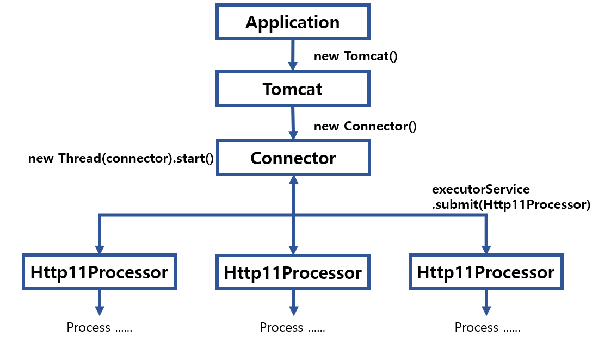
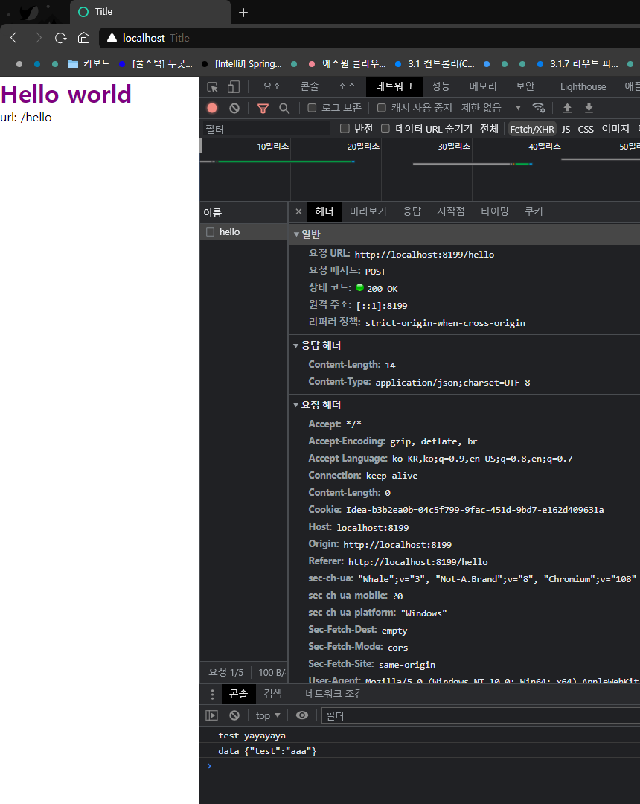
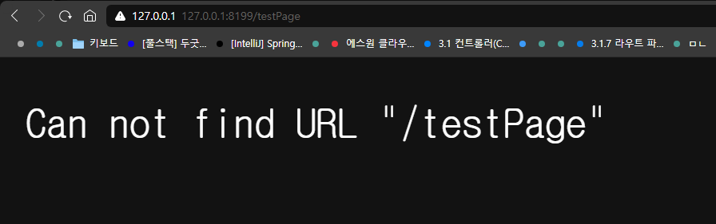

## 프로젝트 계획 계기
spring을 공부하기에 앞서, 사용자에게 웹 페이지를 보여주는 과정을 먼저 공부해보고 싶어져서,  
WAS ( Web Application Server )를 custom으로 만들게 되었다.

## 내가 생각하는 Tomcat의 흐름
내가 생각하는 Tomcat의 흐름은 아래와 같다.  
`클라이언트 요청을 받으면 -> 동적/정적 요청으로 나누고 -> 동적 요청의 경우,  해당 url과 일치하는 controller 매핑 -> 
controller 로직 수행 -> response 반환 -> 사용자에게 보내주기`

## Custom Tomcat의 전체 흐름



## ( 쓰레드 풀 적용 전 )

### 1. 첫 번째는 ``src/main/java/main/controller/Application.java``에서 시작한다.
1.  Application.java에서 메인 메서드를 실행하면 Custom Tomcat(``src/main/java/tomcat/org/apache/catalina/startup/Tomcat.java``)의 start 메서드가 실행된다.
```java
 // Application.java
  public class Application {
      public static void main(String[] args) {
          Tomcat tomcat = new Tomcat();
          tomcat.start();
      }
  }
```
### 2. `start()`메서드에서 먼저, `initialControllers()` 를 통해 컨트롤러 클래스들을 미리 변수 안에 담아둔다. (유연성을 위해 Connector 사용, Http와 통신하는 Http11Processer와 연결하기 위함)
```java
public class Tomcat {
   
     private Map<String, Controller> controllers = new HashMap<String, Controller>();
     private final static String CONTROLLER_PATH = "src\\main\\java\\main\\controller\\";
   
     public void start() {
         initialControllers();

         Connector connector = new Connector(controllers);
         connector.start();

         /**
         * @description
         * 블로그를 참조해서 사용하였다.
         * 아래 코드 없이 CustomTomcat을 실행하려 해봤지만, 유저가 접속하기도 전에 자꾸 꺼지길래 추가하였다.
         * tomcat.join()으로 대기중이면 되지 않을까 생각했지만, 결과는 실패였고, 방법을 찾는 도중에,
         * 아래 코드 형식으로 대기를 시키는 것을 찾아 사용하였다.
         * */
         try {
             // make the application wait until we press any key.
             System.in.read();
         } catch (IOException e) {
             e.printStackTrace();
         } finally {
             System.out.println("finally");
             connector.stop();
         }
     }
   
  /**
  *
  * @description
  * controller 패키지에 있는 .java로 끝나는 Controller 자바 파일들을 가져온다.
  * 가져온 자바 파일들의 이름을 따와, 동적으로 생성자를 만들고, Map안에 넣어둔다.
  * 추후 Controller Handler에서 사용하기 위해 만들었다.
  * */
     private void initialControllers() {
         File rootFile = new File(".");
         String rootPath = String.valueOf(rootFile.getAbsoluteFile());
         rootPath = rootPath.substring(0, rootPath.length() - 1);
         String url = (rootPath + CONTROLLER_PATH).replace("\\", File.separator);

         List<String> fileNameList = Arrays.stream((new File(url)).listFiles())
                 .filter(file -> file.getName().contains(".java"))
                 .map(file -> file.getName().replace(".java", ".class"))
                 .collect(Collectors.toList());

         String controllerPackagePath = CONTROLLER_PATH
                 .replace("src\\main\\java\\","")
                 .replace("\\",".");

         for(String fileName : fileNameList) {
             System.out.println("fileName:" +fileName);
             try {
                 String controllerName = fileName.replace(".class", "");
                 Class<?> findClass = Class.forName(controllerPackagePath+controllerName);

                 // newInstance 메서드를 호출해야, 해당 클래스의 생성자가 실행된다.
                 // controller 상단의 이름 [ ex) HelloController -> hello ]과 
                 // , url [ /hello -> hello ]이 일치하는 경우 해당 Controller 일치할 경우 실행
                 controllers.put(
                         controllerName.replace("Controller","").toLowerCase(),
                         (Controller) findClass.newInstance()
                    );

             } catch (Exception e) {
                 throw new RuntimeException(e);
             }
         }
     }
 }
 ```
```java
public interface Controller {
   HttpResponse service(HttpRequest request, HttpResponse response) throws Exception;
}
```
1. enum으로 관리를 할 까 생각을 했지만, Controller가 생성될 때마다 enum안에 직접 추가를 해줘야 하기 때문에, 자동으로
   넣어주기 위해, 위와 같은 방식으로 만들었다.


### 3. Connector의 start()메서드에서 쓰레드 (자신)을 생성하여 실행한다.
```java
 public class Connector implements Runnable {
     ...
     public Connector() {
         this(DEFAULT_PORT, DEFAULT_MAX_THREAD_COUNT, null);
     }

     public Connector(Map<String, Controller> controllers) {
         this(DEFAULT_PORT, DEFAULT_MAX_THREAD_COUNT, controllers);
     }

     public Connector(int port, int maxThreadCount, Map<String, Controller> controllers) {
         try {
             this.controllers = controllers;
             serverSocket = new ServerSocket(DEFAULT_PORT);
         } catch (IOException e) {
             throw new UncheckedIOException(e);
         }
     }

     public void start() {
         Thread thread = new Thread(this);
         thread.setDaemon(true);
         thread.start();

         stopped = false;
     }
     ...
 }
 ``` 
1. 자신을 실행한 Connector는 **run()** 메서드를 실행하게 된다.
2. Connector 생성자에서 만든 serverSocket의 값이 null이 아닐 경우, 요청을 받을 준비를 한다.
    1. **serverSocket.accept()**는 serverSocket에서 **지정한 포트로 요청**이 올 때까지 대기를 하게 된다.
    2. 요청이 올 경우 **serverSocket.accept()**는 **Socket값을 반환**하며 아래 코드들이 실행한다.
    3. 수행을 다 하면 종료되고, **더이상 요청을 받을 수 없게** 된다.
    4. 하지만 웹 서버는 **지속적으로 요쳥**을 받아야 하는 만큼, **while문을 통해 지속적**으로 **요청을 받을 수 있게** 만들었다.
3. while문을 통해 connect()함수를 실행하고, connect()함수에서 process()함수에 serverSocket.accept()를 넘긴다.
4. process함수는 요청이 오면 실행이 되고, 요청이 올 해당 요청에 대한 쓰레드를 만들어 실행한다.
```java
    public class Connector implements Runnable {
        ...
        @Override
        public void run() {
            System.out.println("connector run...");
            if (serverSocket != null) {
               while(!stopped) {
                   connect();
               }
            }
        }
   
        public void connect() {
            try {
                process(serverSocket.accept());
            } catch (IOException e) {
                throw new RuntimeException(e);
            }
        }

        public void process(Socket socket) throws IOException {
            if (serverSocket == null) return;
    
            Runnable runnable = new Http11Processor(socket, controllers);
            (new Thread(runnable)).start();
        }
        ...
    }
 ```
### 4. Http11Processor 흐름

``흐름: 사용자 요청 -> process() 실행 -> HttpRequest 객체 생성 -> 정적 / 동적 요청 구분 -> controller 매핑
-> HttpResponse 객체 생성 -> 사용자에게 전달``

#### 1. 사용자 요청
1. 상위의 **Connector** 클래스에서 **socket.accept()** 를 Http11Processor 생성자에 주입한다.
2. 그러면 사용자가 요청할 때까지 대기를 하게 되고, 요청이 올 경우 **socket.accept()** 은 Socket 클래스를 반환하며, 대기가 풀리고, 다음 코드가 실행된다.

```java
public class Http11Processor implements Runnable, Processor {
   ...
   Socket connection;

   private Map<String, Controller> controllers = null;

   public Http11Processor(Socket connection, Map<String, Controller> controllers) {
      this.connection = connection;
      this.controllers = controllers;
   }

   @Override
   public void run() {
      try {
         process(connection);
      } catch (IOException e) {
         throw new RuntimeException(e);
      }
   }
   ...
}
```

#### 2. process() 실행

```java
public class Http11Processor implements Runnable, Processor {
   ...
   @Override
   public void process(Socket connection) throws IOException {
      InputStreamReader isr = null;
      BufferedReader br = null;
      HttpRequest httpRequest = new HttpRequest();
      HttpResponse httpResponse = null;
      try {
         isr = new InputStreamReader(connection.getInputStream(), "utf8");
         br = new BufferedReader(isr);
         
         List<String> lines = new ArrayList<>();
         String line = "";

         while ((line = br.readLine()) != null) {
            if (line.equals("")) { // 라인이 공백일 경우, 요청 정보의 끝을 알림
               httpRequest.setHttpRequest(lines);
               if (httpRequest.getHeaders().containsKey("Content-Length")) {
                  httpRequest.initialParams(br);
               }
               httpResponse = createResponse(httpRequest, connection.getOutputStream());

               break;
            } else {
               lines.add(line);
            }
         }

         if(httpResponse != null) {
            httpResponse.sendResponse();
         }

      } catch (IOException e) {
         throw new RuntimeException(e);
      } finally {
         if (br != null) {
            br.close();
         }
         if (isr != null) {
            isr.close();
         }
         if(connection != null) {
            System.out.println("connection close...");
            connection.close();
         }
      }
   }
   ...
}
```

1. 클라이언트에서 요청한 정보는 Socket에 담겨있다. 정보를 가져오기 위해 **socket.getInputStream()** 을 사용했다.
2. inputStream 객체를 읽기 위해 InputStreamReader 객체를, byte를 문자열로 읽기 위해, BufferedReader 객체를 사용했다.
3. "while((line = br.readLine()) != null)" 부분을 통해, 첫줄부터 끝까지 읽도록 만들었다.
4. "if (line.equals(""))" 해당 조건을 건 이유는, 추가 데이터 여부를 판단하기 위해서다. (요청 데이터의 마지막 줄은 ""으로 끝나게 된다)  
   ( Content-Length의 존재 이유는, 추가 데이터가 존재할 시 그 길이만큼 byte를 읽기 위해서로 알고 있다. )
```text
      // 추가 데이터가 없을 경우
      GET /path/to HTTP/1.1
      Accept: "*/*"
      Connection: keep-alive
      Host: localhost:8199
         
      // 추가 데이터가 있을 경우
      GET /path/to HTTP/1.1
      Accept: "*/*"
      Content-Type: application/x-www-form-urlencoded
      Content-Length: 8
         
      str=test
   ```

##### 2.1. HttpRequest 객체 생성
```java
public class HttpRequest {
    private HttpRequestHeader httpRequestHeader;
    private static final String COLON = ":";
    private Map<String, String> headers = new HashMap<String, String>();
    private Map<String, String> requestBody = new HashMap<String, String>();
    
    public HttpRequest() {}
    public HttpRequest(List<String> lines) {
      setHttpRequest(lines);
    }
    public void setHttpRequest(List<String> lines) {
        //lines.get(0) = "GET /hello HTTP/1.1"
        httpRequestHeader = new HttpRequestHeader(lines.get(0));
        lines.remove(0);
        
        // 다른 line 형식 = "[key]: [value]"
        for (String line : lines) {
            String[] keyValue = line.split(COLON);
            headers.put(keyValue[0].trim(), keyValue[1].trim());
        }
    }
    ...
    
    /**
     * @description
     *  - 요청 정보 중, Content-Length가 존재시 실핼되는 메서드로,
     *    Content-Length 길이만큼 반복문을 돌려, 바이트 형태의 데이터를 -> 문자열로 변환한다.
     *  - BufferedReader.readLine()이 아닌, 반복문을 사용하는 이유는,
     *    BufferedReader.readLine()의 경우, 마지막 데이터가 \n인 경우 + 다음 값이 null인 경우에만 다음으로 넘어가진다.
     *    위 조건을 충족하지 못하는 경우 무한 대기 현상이 발생하게 된다.
     *    요청 정보의 파라미터 값 마지막에는 \n값이 존재하지 않기 때문에, 무한 대기현상이 발생하게 된다.
     *    요청자가 임의로 \n로 넣는 상황은 별로 없기에, 서버단에서 처리하기 위해, readLine()이 아닌,
     *    일반 반복문을 사용했다.
     * */
    public void initialParams(BufferedReader br) throws IOException {
        StringBuffer buffer = new StringBuffer();
        int len = Integer.parseInt(this.headers.get("Content-Length"));

        if(len > 0) {
            try {
                for(int i = 0; i < len; i++) {
                    int ch = br.read();
                    buffer.append((char) ch);
                }
                String paramsString = buffer.toString();
                requestBody = Params.strParamToMap(paramsString);

            } catch (IOException e) {
                throw new RuntimeException(e);
            }
        }
    }
}
//====================================================================================================
public class HttpRequestHeader {
   private final static String QUESTION_MARK = "\\?";
   private final static String AMPERSAND = "&";
   private final static String EQUAL_SIGN = "=";
   private HttpMethod method = null;
   private String url = "";
   private Map<String, String> params = null;
   private String version = "";

   public HttpRequestHeader(HttpRequestHeader httpRequestHeader) {
      this.method = httpRequestHeader.method; // GET, POST, ...
      this.url = httpRequestHeader.url; // ex) /hello
      this.params = httpRequestHeader.params;
      this.version = httpRequestHeader.version; // ex) HTTP/1.1
   }
   public HttpRequestHeader(String line) {
      params = new HashMap<String, String>();
      String[] division = line.split(" ");
      this.method = HttpMethod.valueOf(division[0]);

      if(division[1].matches("(.*)"+QUESTION_MARK+"(.*)")) {
         String[] division_url = division[1].split(QUESTION_MARK);
         this.url = division_url[0];
         params = Params.strParamToMap(division_url[1]);
      } else {
         this.url = division[1];
      }

      this.version = division[2];
   }
   ...
}

//====================================================================================================
// Params.java
...
public static Map<String,String> strParamToMap(String paramString) {
    Map<String,String> result = new HashMap<String, String>();

    for(String param : paramString.split(AMPERSAND)) {
        String[] keyValue = param.split(EQUAL_SIGN);
        result.put(keyValue[0], keyValue[1]);
    }

    return result;
}
...
```

1. 끝("")이 아닐 경우에는, lines (List<String>)객체에 추가해준다.
    - 끝("")일 경우 먼저 lines에 저장되어 있는 문자열 정보를 HttpRequest에 추가하여 좀 더 편하게 사용할 수 있도록 가공한다.
    - 그리고, "Content-Length" 데이터 존재 여부에 따라, 추가 데이터 여부를 판단한다.
    - 추가 데이터가 존재할 시, "Content-Length" 길이 만큼 반복문을 돌려 바이트를 읽고 -> 문자열로 변환하여 -> 가공한다.
2. 만들어진 HttpRequest 객체를 가지고 **createResponse()** 메서드를 실행한다.
3. 비어있는 HttpResponse를 생성하고, **socket.getOutputStream()** 메서드를 통해 **socket의 OutputStream객체를 response객체에** 넣어준다.
    - OutputStream객체를 좀 더 쉽게 사용하기 위해, DataOutputStream 객체에 OutputStream객체를 넣어준다.

#### 3. 정적 / 동적 요청 구분 & controller 매핑 & HttpResponse 객체 생성


```java
public class Http11Processor implements Runnable, Processor {
   ...
   private HttpResponse createResponse(HttpRequest request, OutputStream out) throws IOException {
      HttpResponse response = new HttpResponse(out);
      String url = request.getUrl();

      if (FileUtils.isStaticRequest(url)) { // 정적요청 o
         String fileStr = FileUtils.fileToString(url);
         response.setResponse(HttpStatus.OK, fileStr, ContentType.getContentType(url));
      } else {
         String controllerName = refineControllerName(request.getUrl());
         try {
            Controller controller = controllers.get(controllerName);
            if (controller == null) { // 해당 url에 맞는 controllr가 없는 경우 에러
               response.setResponse(HttpStatus.NULL, "Can not find URL \"" + request.getUrl() + "\" ", ContentType.TEXT);
               response.sendResponse();
               throw new RuntimeException("cannot find controller [" + controllerName + "]");
            }
            return controller.service(request, response);

         } catch (Exception e) {
            throw new RuntimeException(e);
         }
      }

      return response;
   }
   ...
}
```
```java
public class FileUtils {
   ...
   public static boolean isStaticRequest(String url) {
      return url.matches("^.*\\.(html|css|js|ico).*");
   }
   
   public static String fileToString(String path) throws IOException {
      // "/path/to" => "path/to"
      // resources에서 파일을 찾기 위해 조건 설정
      URL url = getResourceURL(path);
      if(url == null) throw new FileNotFoundException("Can not find \""+path+"\"");

      return fileToString(new File(url.getPath()));
   }
   
   public static String fileToString(File file) throws IOException {
      if(!file.isFile()) throw new FileNotFoundException("Can not find File");

      BufferedReader bf = null;
      bf = new BufferedReader(new InputStreamReader(new FileInputStream(file), "UTF8"));
      String line = "";
      StringBuffer sbf = new StringBuffer();
      while((line = bf.readLine()) != null) {
         sbf.append(line);
      }

      return sbf.toString();
   }
   ...
}
```
```java
public class HttpResponse {

   DataOutputStream dos;
   int status;
   Map<String, String> headers = new HashMap<String, String>();
   String responseBody = "";

   Map<String, String> headers = new HashMap<String, String>();
   String responseBody = "";
   public HttpResponse() {}

   public HttpResponse(OutputStream out) throws IOException {
      this.dos = new DataOutputStream(out);
   }

   public HttpResponse(HttpStatus status, String responseBody, ContentType contentType) {
      setResponse(status, responseBody, contentType);
   }

   public void setResponse(HttpStatus status, String responseBody, ContentType contentType) {
      this.setStatus(status);
      this.responseBody = responseBody;
      this.headers.put("Content-Type", contentType.getContentType());
      this.headers.put("Content-Length", String.valueOf(responseBody.toString().length()));
   }

   public void setStatus(HttpStatus status) {
      this.status = status.getStatus();
   }
   ...
}
```
1. 먼저, HttpRequest.getUrl()을 통해 정적 / 동적 요청인지 판단한다.
    - 정적 요청에 경우, 요청한 url에 맞는 파일이 **존재 여부를 판단**한다.
        - 존재 시, FileUtils.fileToString() 메서드를 통해, url에 대해 존재하는 파일의 정보를, 문자열로 저장한다.
        - 해당 정보를 **setResponse()** 메서드에 넘겨준다.
    - 동적 요청의 경우, 미리 모아둔 컨트롤러 모음 객체에서 찾는다. ( **url과, Controller앞의 이름과 매칭**하여 일치하는것을 찾는다)
        - ex) /hello | HelloController
    - 그리고 해당 컨트롤러의 **service()** 메서드를 실행한다. (respnose객체를 넘겨준다.)
    - Controller의 **service()** 메서드에서 개발자가 원하는 처리를 한 후, HttpResponse객체의 setResponse() 메서드를 통해 **데이터를 주입** ->
      **HttpResponse를 반환**한다.
    - 정적 / 동적 요청 둘 다 HttpResponse 객체를 반환한다.

#### 4. 사용자에게 전달
```java
public class HttpResponse {
   ...
   public void sendResponse() throws IOException {
      try {
         String resultTxt = this.status >= 200 && this.status < 300 ? "OK" : "Not Found";
         
         byte[] body = this.responseBody.getBytes(StandardCharsets.UTF_8);
         this.dos.writeBytes("HTTP/1.1 " + this.status +" "+ resultTxt +" \r\n");
         this.dos.writeBytes("Content-Type: "+this.headers.get("Content-Type") + ";charset=UTF-8\r\n");
         this.dos.writeBytes("Content-Length: "+this.responseBody.toString().length()+"\r\n");
         this.dos.writeBytes("\r\n");
         this.dos.write(body);
         this.dos.flush();
      } catch (IOException e) {
         throw new RuntimeException(e);
      } finally {
         if(this.dos != null) {
            this.dos.close();
         }
      }
   }
   ...
}
```
1. 반환된 HttpResponse객체의 **sendResponse()** 메서드를 실행한다.
    - 클라이언트가 알아들을 수 있는 정보로 바꿔준다.
   ```text
      Http/1.1 200 OK            <-- 성공, 실패 여부 설정
      ...                        <-- 그 이외의 추가하고 싶은 정보
      Content-Type: text/plain   <-- 반환 데이터의 타입 설정
      Content-Length: 17         <-- 반환 데이터의 길이
                                 <-- 정보의 끝을 알림
      its response data          <-- 반환 데이터
      
      --------------------
      위의 정보는 DataOutputStream.writeBytes("...") 메서드를 통해 넣어준다. 
      ( 문자열을 바이트로 치환해 OutputStream 객체에 넣어준다. )
         
      "반환 데이터 영역에 html데이터를 문자열로 변환 및 넣어주고, 
       Content-Type을 "text/html"로 설정 시 html 타입의 데이터가 된다."
   ```

2. 브라우저에서 로컬주소:설정한포트/controllerName 입력 시 출력이 되는걸 확인할 수 있다.
    - 또는 postman으로 테스트가 가능하다.
3. 아래 이미지는, get, post 메서드 2개 테스트한 결과다.
   

<br>
<br>

#### controller 매핑 못할 시 (url 잘못 입력시)


## ( 쓰레드 풀 적용 후 )

### ExecutorService
쓰레드 풀의 역할을 수행하는 객체는, `ExecutorService`로 알고 있다.

### Connector.java

```java
class Connector implements Runnable {
    ...
    private ExecutorService executorService = null;
    private CountDownLatch countDownLatch = null;
    
    public void start() {
        ...
        this.executorService = Executors.newFixedThreadPool(5);
        this.countDownLatch = new CountDownLatch(5);
        ...
    }
    ...
}
```
ExecutorService를 통해 쓰레드 풀 기능을 구현하였다.

### Http11Processor.java
```java
public class Http11Processor implements Runnable, Processor {
   ...
   private CountDownLatch countDownLatch = null;
   
   public Http11Processor(Socket connection, Map<String, Controller> controllers, CountDownLatch countDownLatch) {
      this.connection = connection;
      this.controllers = controllers;
      this.countDownLatch = countDownLatch;
   }
   ...
}
```
먼저, 생성자에서 매개변수에 `CountDownLatch countDownLatch`부분을 추가 해주었다.

```java
public class Http11Processor implements Runnable, Processor {
   ...
   @Override
   public void process(Socket connection) throws IOException {
      InputStreamReader isr = null;
      OutputStream os = null;
      BufferedReader br = null;
      HttpRequest httpRequest = new HttpRequest();
      HttpResponse httpResponse = null;
      try {
         isr = new InputStreamReader(connection.getInputStream(), "utf8");
         br = new BufferedReader(isr);


         List<String> lines = new ArrayList<>();
         String line;

         while ((line = br.readLine()) != null) {
            if (line.equals("")) {
               httpRequest.setHttpRequest(lines);
               String contentLength = "Content-Length";
               if (httpRequest.getHeaders().containsKey(contentLength)) {
                  httpRequest.initialParams(br);
               }
               httpResponse = createResponse(httpRequest, connection.getOutputStream());

               break;
            } else {
               lines.add(line);
            }
         }

         if(httpResponse != null) {
            httpResponse.sendResponse();
            countDownLatch.countDown();
         }

      } catch (IOException e) {
         throw new RuntimeException(e);
      } finally {
         if (os != null) {
            os.close();
         }
         if (br != null) {
            br.close();
         }
         if (isr != null) {
            isr.close();
         }
         if(connection != null) {
            System.out.println("connection close...");
            connection.close();
         }
      }
   }
   ...
}
```
그리고 `process()`메서드에서 response를 보내는 과정 다음 라인에, `countDownLatch.countDown();` 부분을 추가 해주었다.

### CountDownLatch
**어떤 쓰레드가 다른 쓰레드에서 작업이 완료될 때까지 기다릴 수 있도록 해주는 클래스**

#### 예제
Tomcat을 구현하면서 만든 `Connector.java`에서
```java
public class Connector implements Runnable {
   ...
   @Override
   public void run() {
      System.out.println("connector run...");
      if (serverSocket != null) {
         while(!stopped) {
            connect();
         }
      }
   }

   public void connect() {
      try {
         process(serverSocket.accept());
      } catch (IOException e) {
         throw new RuntimeException(e);
      }
   }
   
   public void process(Socket socket) throws IOException {
      if (serverSocket == null) return;

      Runnable runnable = new Http11Processor(socket, controllers, countDownLatch);
      this.executorService.submit(runnable);
      // 다음 코드...
   }
   ...
}
```
위의 코드에서 보면 메인(Connector)쓰래드를 실행할 경우, `run()`메서드가 실행되며,  
`while()`루프를 통해, 연결을 여러번 시도하고, `Processor 쓰레드`를 생성 및 `executorService`에서 관리하도록 만들었다.  
여기서 `countDownLatch`를 적용 안 할 경우, `process()`메서드에서 쓰레드 생성 및 실행 후,  
쓰레드 안의 코드가 끝나지 않았음에도, `//다음 코드..` 부분이 실행이 된다.  
쓰레드 안의 코드가 끝나고, `//다음 코드..` 부분이 실행이 되도록 만드는게 `countDownLatch`인걸로 이해했다.


## 참고 사이트
- https://webfirewood.tistory.com/78
- https://os94.tistory.com/171

## 소스코드 주소

 - <a href="https://github.com/JangHyuckYun/Study_Java/tree/main/implement_was" target="_blank">https://github.com/JangHyuckYun/Study_Java</a>
