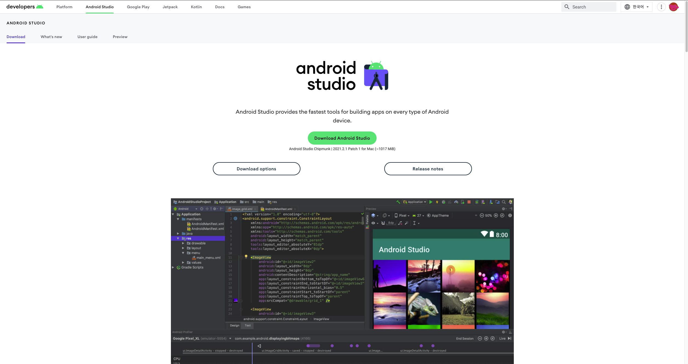
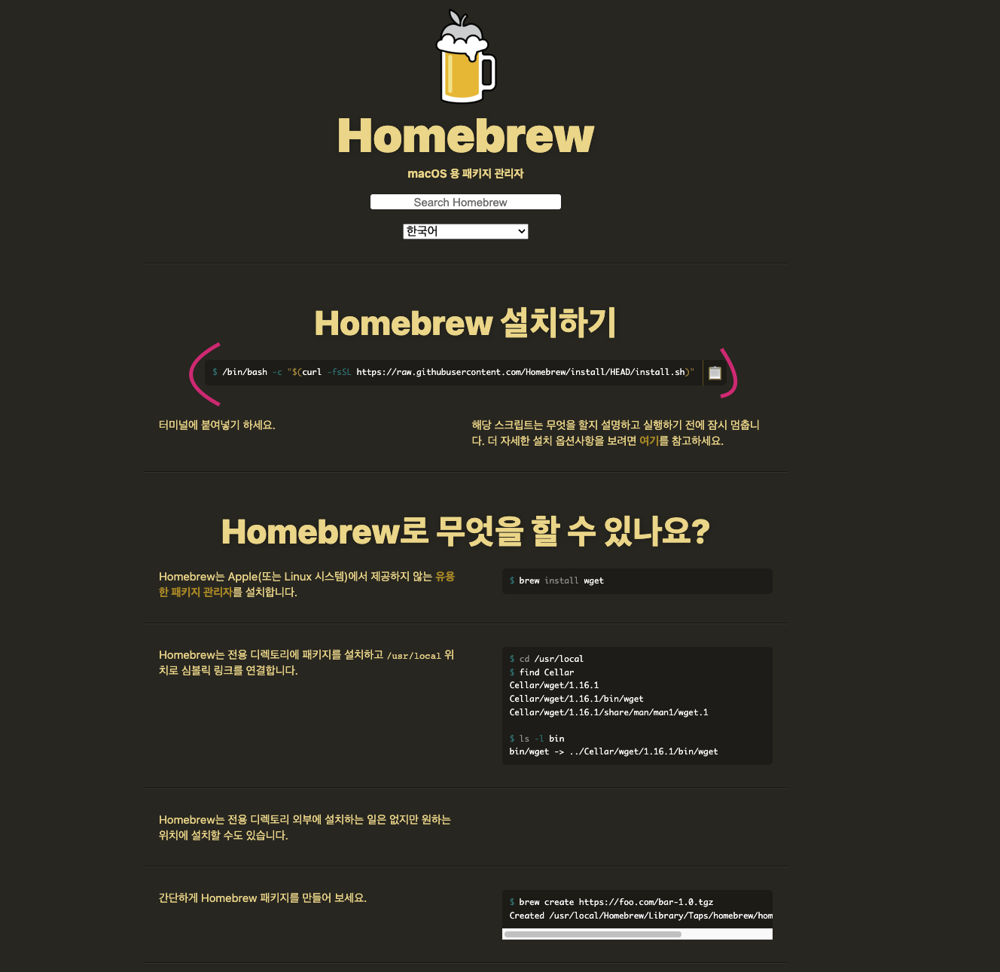
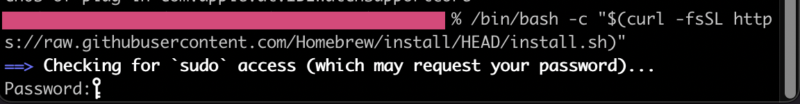
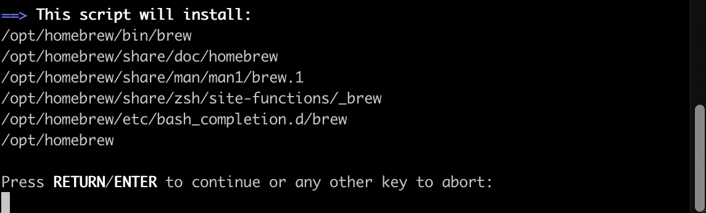

## Android Studio 설치

먼저 https://developer.android.com/studio 사이트에 접속하여 안드로이드 스튜디오를 다운 받는다.

다음으로 Homebrew 공식 사이트 "https://brew.sh/index_ko" 에 접속 후 메인에 바로 나와있는 명령어를 iterm( terminal )에 복붙 후 엔터 해준다.

아래 사진처럼 패스워드가 나오게 되고, 맥북의 비번을 입력해주면 된다.

그러면 아래 사진처럼 나오게 되고, Enter를 누르면 설치가 된다.
( xcode를 미리 설치 하였을 시 가끔 license 관련해서 에러가 나오기도 한다. 나 "https://anywaydevlog.tistory.com/13#recentComments" 여기 사이트를 보고 해결했다. )

