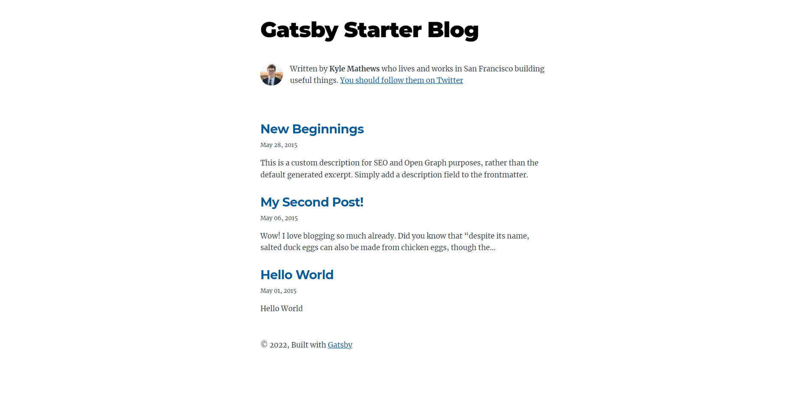

React와 GraphQL을 기반으로 만들어진 framework 이다.

---

# Gatsby를 쓰는이유

공식 문서에서 한 부분에는 `React, GraphQL, 웹팩등과 같은 최첨단 기술을 결합해 믿을 수 없을정도로 우아한 개발자 경험을 만들어낼 수 있고,  
애플리케이션 구축에 더 많은 시간을 할애하고 애플리케이션 유지 보수 및 최적화 시간을 줄일 수 있다.` 라고 나와있다.  
내(초보 개발자)가 Gatsby를 사용하여 블로그를 만들면서 느낀건 `복잡하다`였다. **리액트 사용하는데 있어 익숙하지 않고,
GraphQL을 쓴적이 거의 없고, Webpack에 대한 개념이 별로 없고, Gatsby를 자세히 보지 않았고, nodeJS를 잘 사용하지 않았다면**
초반에 설계하는데, 구조를 대부분 이해하는데 좀 어려움을 느낄 수 있다. (나도 지금 전체적인 프로세스를, 구조를 잘 모르고 이해하려고 계속 공부하고 있다.)  
그럼에도 **Gatsby를 추천한다면 추천할 것 같다.** 이유로는 
1. GraphQL에 대한 개념을 공부할 목적을 얻게 된다.
   - 나는 공부할 언어, 라이브러리 등에 **명확한 목적**이 없으면 잘 공부하지 않게된다. 하지만 Gatsby를 사용함으로써 필연적으로 GraphQL은 사용해야 하고, 사용해야함으로써 공부할 목적을 얻게 되고, 추 후 다른 곳 `Spring 등`에서 사용할 수도 있어 좋은것 같다.
2. 듣기로 **React**를 사용하면서 블로그를 만들때 깃헙 페이지를 이용해도 되지만 깃헙에서는 주로 **Jekyll**를 사용하고 있고, 이 **Jekyll**은 **Ruby언어 기반**으로 되어있어 **React**로는 커스터마이징이 힘들다고 한다. **React**라이브러리 기반으로 만들 분들은 **Jekyll**을 사용하여 해도 되지만 아무래도 **React** 기반으로 만들어진 **Gatsby**를 쓰는게 좋지 않을까 싶다.
3. 위에서 말했듯이 **커스터마이징을 쉽게** 할 수 있고, **템플릿**도 있어 자유롭게 선택하여 만들 수 있다.
4. 다른 이유는 지금 생각나지 않아 추후 업데이트 할 예정이다.

---

# Gatsby 기본 템플릿으로 빌드까지

`※윈도우 기준으로 작성하였습니다.`   
  
`Gatsby를 설치하기에 앞서 기본적으로 Node.js는 설치되있어야 합니다.`
## NodeJS 설치법

1. [NodeJs 설치 사이트](https://nodejs.org/ko/) 옆의 링크를 클릭후 들어간다.
2. 초록색 박스 중 'LTS'가 포함된 버튼을 클릭하여 다운한다. (안정적, 신뢰성이 높은 버전이라 추천한다.)
3. 다운받은 파일을 실행하여 다운 받아준다.
4. cmd 창을 열고 ("Win + R" 을 누른 후 "cmd"를 입력 후 들어간다.) `node -v` 명령어를 입력하여 에러가 뜨지 않는다면 설치는 다 되었다.

## Gatsby 설치하기

`※ Intellij, Visual Studio Code등의 Terminal(cmd)창이 있는 사람들은 거기서 명령어를 입력하면서 따라오면 된다.`

1. 먼저 Gatsby로 만들 프로젝트를 담을 폴더 하나를 아무곳에 만들어 준다.
2. 해당 폴더에 프롬프트(cmd)창을 열어준다. (해당 폴더의 경로를 클릭 후 "cmd" 입력 또는 "Win + R" 누른 후 "cmd" 친 후 Enter 누른다. 다음에 프로젝트를 생성한 경로를 입력(`cd ./test/myProjects`)하여 들어간다. )
3. cmd창에 `npm i -g gatsby-cli` 명령어를 입력하여 gatsby를 cmd창에서 조작할 수 있도록 설치해준다.
4. **https://github.com/gatsbyjs/gatsby-starter-blog** 주소로 들어가서 **README.md** 파일에 잘 설명이 되어 있으니 보고 따라 설치하면 된다.
   1. cmd 창에 `gatsby new [your blog name] https://github.com/gatsbyjs/gatsby-starter-blog` 을 입력하고 Enter! ("[your blog name]"은 너가 정하고 싶은 이름을 적어주면 된다.)
   2. cmd 창에 `cd [your blog name]` 입력 후 Enter 하면 해당 폴더로 들어가진다.
   3. 여기서 `gatsby develop` 명령어 입력 후 Enter 하면 기본 블로그 플러그인으로 만든 페이지가 실행된다.
   4. 접속 주소는 보통 "http://localhost:8000" 이다. (cmd창에 나와있으니 거기서 들어가면 된다.)

위의 사진이 해당 주소로 접속하고 들어갔을 때 나오는 사진이다.

---

## 마지막으로 해당 프로젝트의 구조

해당 프로젝트의 대한 설명은 위에 올린 https://github.com/gatsbyjs/gatsby-starter-blog 주소에 잘 나와 있으나 혹시 몰라 여기에 정리해두었다.  

> 위에 올린 주소에서 본 내용을 바탕으로 작성하였습닌다. 

`node_modules/` : package.json 파일을 보면 "dependencies"안에 "key:value"으로 이루어진 것들이 많이 있을것이다. 여기 key들이 프로젝트에 설치된 모든 것(`npm i` 명령어를 통해 설치된 것들)들이 이 `node_modules`안에 들어있다.   
  
`src/` : 사이트의 Header, Page Template와 같은 브라우저에서 볼 수 있는 내용에 관련된 코드들이 포함되어 있다.  
  
`content/` : 여기 안의 파일들이 실제로 html 파일로 변환될 것들의 markdown 파일들이 모여있는 곳이다.  
  
`.gitignore` : git에 내가 만든 파일을 올릴 때 어떤 파일들, 폴더들을 올리지 말지 정해주는 녀석이다.  
  
`.prettierrc` : 이건 내가 작성한 코드를 어떤 방식으로 예쁘게 정리할지 정의하는 녀석이다. [Prettier](https://prettier.io/)  
  
`gatsby-browser.js` : Gatsby가 [Gatsby Browser API](https://www.gatsbyjs.com/docs/reference/config-files/gatsby-browser/)가 있는경우 연결해준다. 브라우저에 영향을 미치는 기본 Gatsby 설정을 사용자 정의/확장 할 수 있다고 나와있는데 이부분은 나도 자세히 들여다보지 않아 잘 모른다.  
  
`gatsby-config.js` : Gatsby 사이트를 구성하는거에 대한 설정파일이다. 여기서 사이트 제목 및 설명과 같은 사이트(메타데이터)에 대한 정보를 작성할 수 있고, Gatsby에 관련된 플러그인을 사용하려 할 때 보통 여기에 작성한다. (`npm i [설치할 gatsby plugin]`도 명령창에 실행시켜야 에러가 나지 않는다.)  
  
`gatsby-node.js` : "사이트의 각 페이지를 구성하는데 있어 어떤식으로 구성할지 정하는 녀석이다."라고 나는 사용하면서 이해했다.
  
`LICENSE` : `이 개츠비 선발자는 0BSD면허에 따라 면허가 있다. 즉 이 파일을 자리 표시자로 보고 자신의 라이센스로 바꿀 수 있다.` 라고 깃헙에 명시되어 있다.
  
`package.json` : `메타데이터(프로젝트의 이름, 작성자 등)를 포함하는 Node.js 프로젝트의 매니페스트 파일. 이 매니페스트는 npm이 프로젝트에 설치할 패키지를 어떻게 아는가` 라고 깃헙에 명시되어 있다.
  
`package-lock.json` : 이 파일은 보통 package.json 파일이 수정되면서 자동으로 수정되는 녀석인데 이 파일은 수동으로 건들면 안된다!!
  
`README.md` : 프로젝트에 대한 정보를 보통 여기에 작성한다.

---

# 다른 템플릿 적용법

프로젝트를 만들 때 `npx gatsby new [your project name] [템플릿 깃헙 주소]` 를 입력하여 설치하면 된다.

---

# 마치며

궁금한 점이나 수정했으면 하는 사항은 댓글로 남겨주시면 보는 즉시 답변해드리겠습니다.

