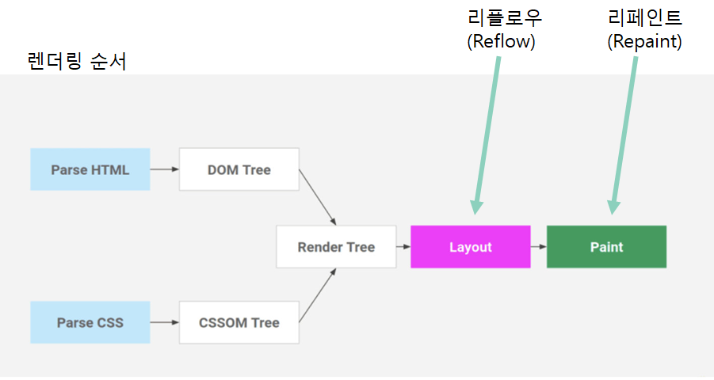
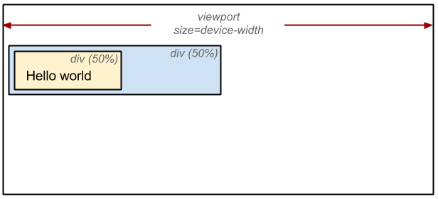
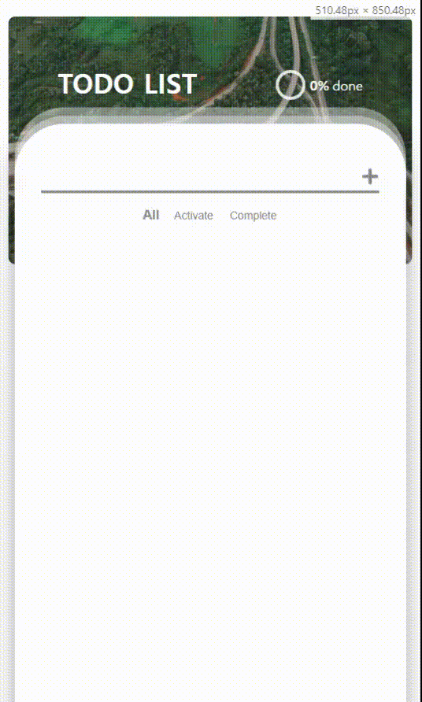
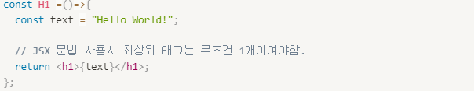
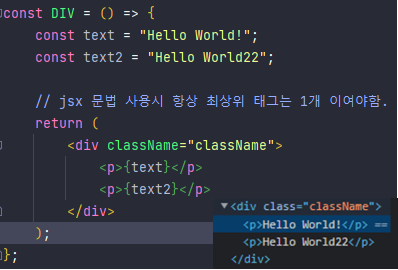
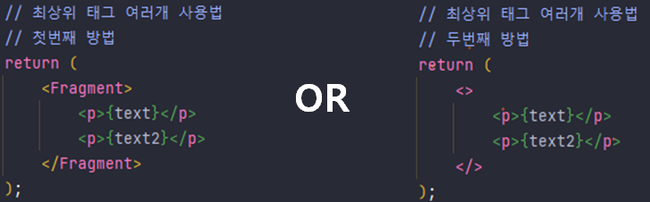
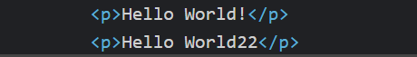

## 리액트란?

- Javascript 라이브러리로써 싱글 페이지 애플리케이션의 UI(User Interface)를 생성하는데 집중한 라이브러리
- 가상 돔(Virtual DOM)이라는 개념을 사용해 웹 애플리케이션의 퍼포먼스를 최적화
- JSX(Javascript XML) 이라는 간단한 문법 사용

## 리액트의 특징

---

### 가상돔(Virtual DOM)

가상돔을 이해하기 앞서 먼저 HTML, CSS가 렌더링(Rendering) 되는 과정 이해 필수.

### **렌더링(Rendering)**

**렌더링 순서 - Layout (Reflow)**

- viewport 내에서 각 요소의 정확한 위치, 크기, 색상 등 스타일 계산

**리플로우(Reflow), 리페인트(Repaint)**

**리플로우(Reflow)가 일어나는 대표적인 속성들**

position, width, height, margin, padding, border, border-width, font-size, font-weight,        line-height, text-align, overflow ...

**리페인트(Repaint)만 일어나는 대표적인 속성들**

background, color, text-decoration, border-style, border-radius, visibility ...

**리페인트(Repaint)도 일어나지 않는 속성**

transform, opacity, cursor, orphans, perspective

**가상돔(Virtual DOM)**

- 리액트는 이 리플로우(Reflow) / 리페인트(Repaint)가 자주 수행되는 문제를 해결하기 위해 **화면에 표시되는 DOM과 동일한 DOM을 메모리상에 만들고** DOM 조작이 발생하면 **메모리상에 생성한 가상돔에 모든 연산을 수행 후, 실제 DOM을 갱신**하여 리플로우/리페인트 연산을 최소화 하였음.

- DOM에서 **일어나게 될 변화**를 가상 돔에서 브라우저의  처리과정 중 렌더링 과정까지(Painting 등 특정 단계 제외) 진행하면서 그 기록을 저장하고, 실제 DOM에게 그 변화의 결과만 전달해주어, 사용자에게 보여주게 된다.

**가상돔(Virtual DOM) 의 필요성**

규모가 큰, 특히 SPA 방식의 웹 어플리케이션 같은 경우 **사용자와의 상호작용(인터랙션)**으로 일어나게 될 변화의 양은 적게는 수십번, 많게는 수천번까지 된다.

그렇게 되면 위와 같은 브라우저 처리과정을 수십번에서 수천번까지 실제 돔에서 계속 **렌더링**과 **페인팅 등 과정**을 거치게 된다.

하지만, 가상돔 같은 경우 **이러한 변화의 양을 한번에 묶어서 최종적으로 계산된 레이아웃의 정보**만 실제 DOM에게 던져주게 된다. 기존보다 연산 양이 적어지므로 그만큼 쾌적한 UI를 제공할 수 있다.

***

## JSX(Javascript XML)

- 자바스크립트와 HTML을 동시에 사용하며, HTML에 Javascript 변수들을 바로 사용할 수 있는 일종의 템플릿 언어(Template language)

**JSX(Javascript XML) 규칙**

