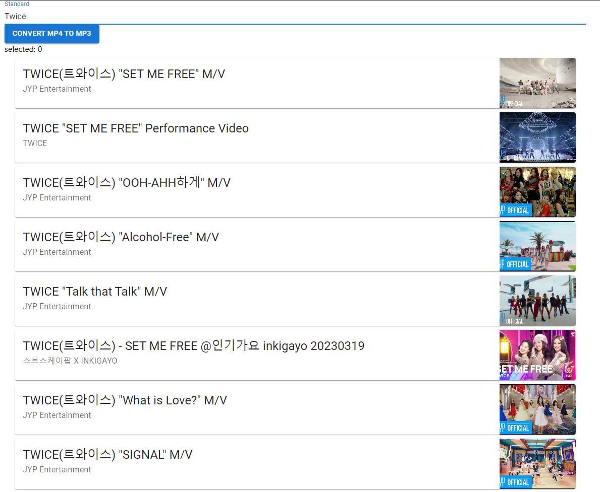
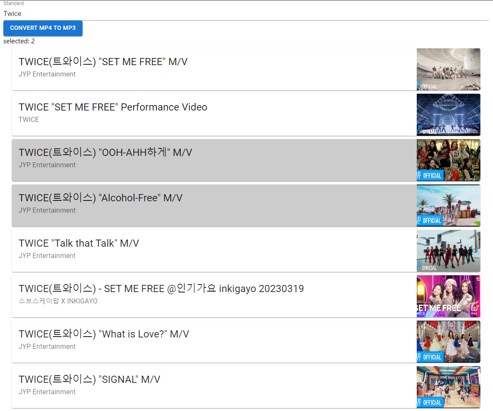
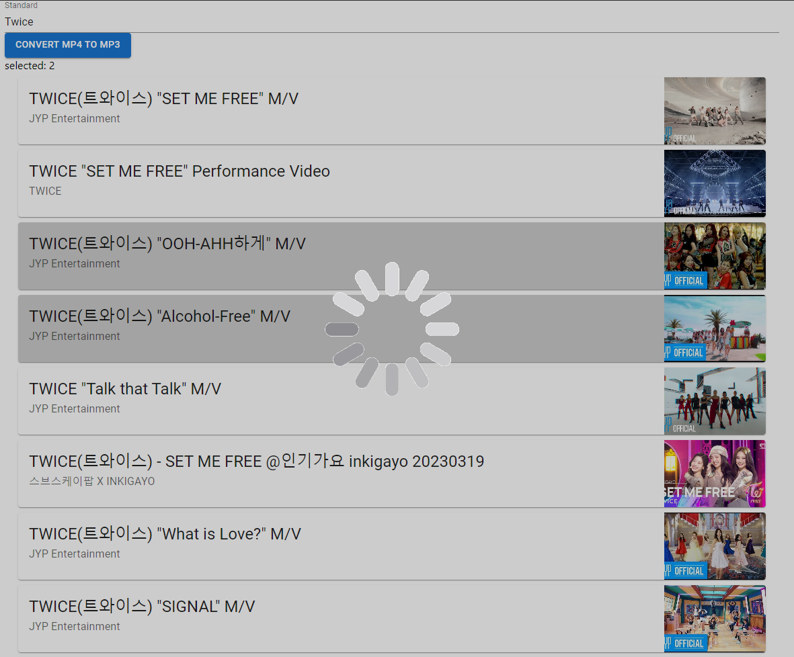
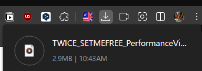

# youtube Video to MP3

기존에는 유튜브에 직접 들어가서 영상을 찾고 -> 링크를 복사해서 -> 변환 사이트에 들어가 복사를 하고 대기 후 다운로드를 해야 한다.
이 과정이 번거로워, 한 사이트 안에서 유튜브 검색을 하고, 변환 작업까지 한 번에 하도록 만들었다.  
> 부모님이 차에서 노래를 듣기 위해, 컴퓨터를 사용해서 usb에 다운 받는데, 항상 나에게 부탁한다.  
>  그래서 혼자서도 잘 하실 수 있도록 간결하고, 빠르게 만들자고 결심하게 되었다.

## 링크
[Youtube To Mp3](https://youtubetomp3.sodiapp.com/)  
[Youtube To Mp3 Source Code in Github](https://github.com/JangHyuckYun/youtubeVideoToMp3)

## 기술 스택

### Front-End
- HTML
- CSS
- JavaScript Library
  - React
  - Design Library - MUI

### Back-End
- Node.JS
  - Express.js
  - Typescript
  - 유튜브 mp4 다운로더: **'ytdl-core'**
  - 유튜브 영상 검색: **'youtube-search-api'**
  - mp4 to mp3: **'ffmpeg'**
  
### 배포 환경
- Ubuntu

## 흐름
1. 검색창에 찾고자 하는 음악 이름 검색 후 Enter

2. 검색해서 나온 결과 중에 마음에 드는 영상 다중 선택 ( 1개 이상 ) 후 버튼('Convert mp4 To mp3') 클릭

3. 상단의 버튼 클릭 시 로딩창이 나타나고, 변환 수행

4. 로딩이 끝나고, 자동 다운로드

## 주의할 점
- 음원으로 바꾸기 위해 빠르게 기능 구현을 하느라, 크기 제한, 개수 제한, 안 되었을 때의 로직이 많이 구현되어 있지 않음.
- 때때로 실패할 때가 있음 / 사이트를 오래 켜두거나, 특정 조건의 경우 기능이 동작하지 않는 경우가 존재
-  -> 가끔 다운이 안 되어서 로그를 살펴보니, mp3생성 자체는 잘 되는데, 전송 부분에서 문제가 있는것 같았다.
- 추 후 여유로울 때 수정할 예정
> **서버 또는 우분투 환경에서 backend를 다운 받아 실행하려 할 경우, ffmpeg가 따로 설치가 되어 있어야 정상적으로 자동한다.**

## 후기

빠르게 만들고, 쉬자는 생각으로 해서 만들었지만, 너무 대충 만든게 아닌가 하는 생각이 들었다.  
그래도 나름 공을 들여 개인 서버에 배포를 해 둔 상태이지만, 디자인 수정 / 에러 로직 / mp3 파일 전송 로직 등 수정이 필요해 보였다.
그리고, express의 response.download 함수를 사용해서 Blob 형태로 보내도록 해 두었는데,  
파일을 쪼개서 보내는 식으로 해야 할까 고민이 들었다.  
그래도 크게 문제는 없으니까 당분간은 냅두고, 여유로울 때 or 추 후 문제가 생기면 수정 할 예정이다. 
