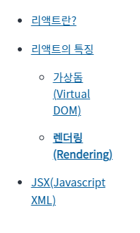
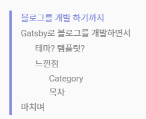
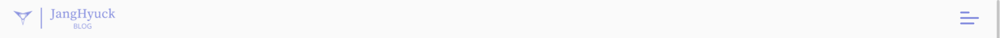
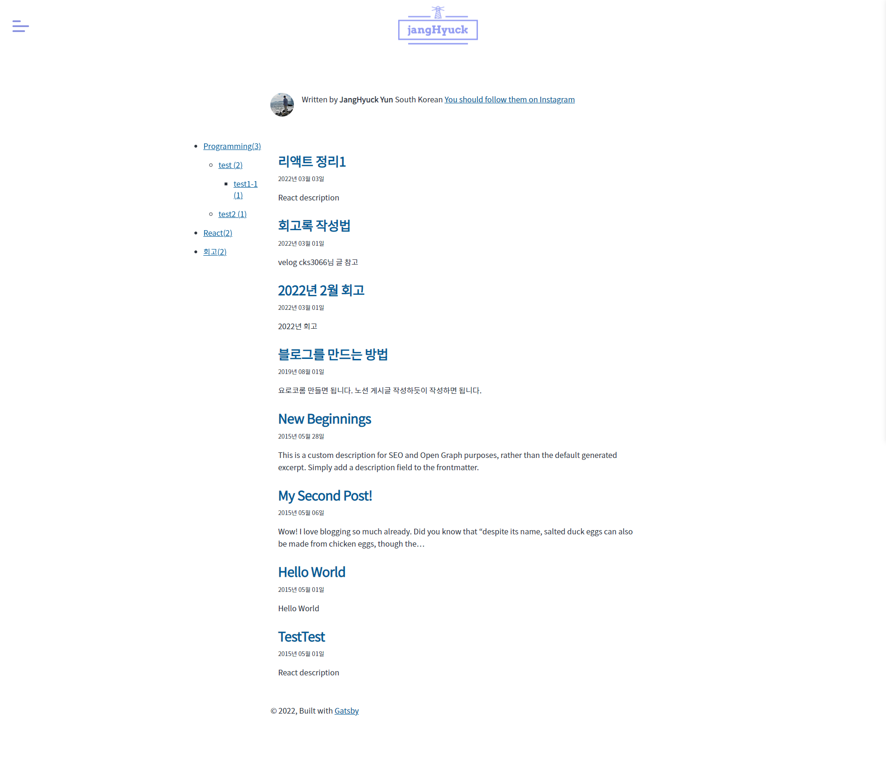
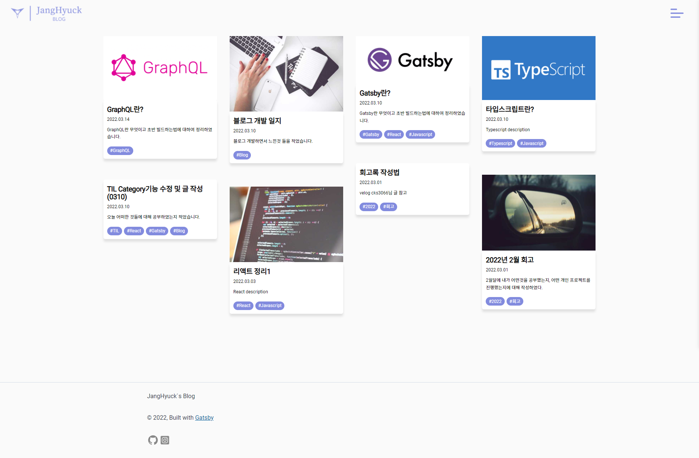

---

# 한 일

오늘은 전체적으로 블로그 기능 및 스타일링을 추가 하였다.

---

## 태그
태그 기능을 만들었다. 카테고리 기능만 넣기엔 메인페이지가 허전에 보이기도 하고 Masonry Layout 이랑도 어울리는것 같지가 않아서
좌측에 보여주던 카테고리를 지우고 태그를 추가 하였다.  
마크다운으로 글 작성 시 위에 해당 글에 대한 정보를 적는데 그 부분에 tags를 추가하여 배열 형태로 받도록 하였고, 여러 태그를 넣을 수 있도록 만들었다.

```markdown

---
...
tags: [ "TIL", "React", "Gatsby" ]
...
---

# Hello
```

`index.js` 파일에서 각 postItem에 GraphQL로 가져온 태그 데이터를 for문을 이용해 화면에 나오도록 만들었다.  

```javascript
//index.js의 PostItem 컴포넌트 상세 부분
// 태그가 한개 이상일 때만 화면에 출력되도록 조건문 추가 하였음.
...
return (
...
{ tags.length > 0 ? (<ul className="tags">
    {tags.map(tag => <li className="tag"><span>#{tag}</span></li>)}
</ul>) : "" }
...
);
```

---

## SCSS -> CSS

`gatsby-plugin-blog` 를 통해 만든 블로그에는 기본적으로 `style.css`, `normalize.css` 등의 기본 파일이 만들어진다.  
오늘은 이중에서 `style.css` 파일만 `style.scss` 로 바꾸어 주고,  `gatsby-browser.js` 파일에서 `import "./src/style.css"`의 확장자를
`scss`로 바꾸어주어 `scss`로 바꾸어도 에러가 나지 않도록 수정했다. 이후엔 입맛에 맞게 바꾸었다.(추후 수정 예정) 
내일은 `normalize.css`의 확장자를 `scss`로 바꾸어 주고 입맛에 맞게 코드를 바꿀 예정이다.

---

## 스타일링

- TOC

### TOC

먼저 TOC(table of contents)의 스타일링을 교체해주었다.



위의 사진이 스타일링 전 TOC이다. 첨엔 기능만 만들고 나중에 스타일 추가 해주자 하고 넘겼었는데 넘기고 넘겨 오늘에서야 스타일링을 하게 되었다.



위의 사진이 스타일링 1차 버전이다. `list-style:none;` 값을 주어 옆에 점? 구분점? 을 없애주고, 위 아래 간격을 좁혀주고, 폰트 사이즈를 줄여주었다.
다음으로 마우스 호버 시 폰트의 색이 보라색으로 바뀌도록 하였고, 추후에 스크롤 위치에 따라 호버된 효과를 주도록 만들 예정이다.

### Header

다음으로 최 상단에 위치해 있는 헤더의 디자인을 변경해주었다.


위의 사진이 스타일링을 좀 해둔 헤더다. Masonry 레이아웃과 뭔가 조화롭지 않은 느낌이 들기도 하고, 로고 디자인 + 위치가 마음에 들지 않아 바꾸었다.



위의 사진이 스타일링 2차 버전이다. 로고하고 메뉴의 위치를 입맛에 맞게 바꾸었다.

### Main Page

여기에 공을 좀 많이 들였다.



스타일링을 하나도 안건든 초기 버전의 메인페이지다. 옆의 카테고리 위치도 위치고 폰트, 글 나열 방식, 스타일 등이 다 맘에 안들어서 싹 다 바꾸어 주었다.



스타일링 2차버전의 메인페이지다. 1차버전은 태그 추가 및 푸터 스타일링 전이다. (Masonry Layout을 적용하려 하면서 각 글의 타이틀의 이미지를 가져와야 하는데
이부분에서 처음에 되게 애먹었었다.) Masonry Layout 적용 및 태그 추가, 헤더 스타일링을 하면서,
푸터 디자인하기엔 힘을 다 써버려서 다음에 하기로 미루고 간단하게만 바꾸었다. velog 처럼 포스터 마우스 호버 시 약간 위로 올랐다가 떼면 내려간다.
아직 허전하고 배경색도 어떤걸로 해야할지 모르겠고, 어떤걸 추가해야 할 지 고민중이다.

# 마치며

매일 쓰려고 노력은 하지만 습관이 들어서 인지 매일 쓰는게 쉽지가 않다.
