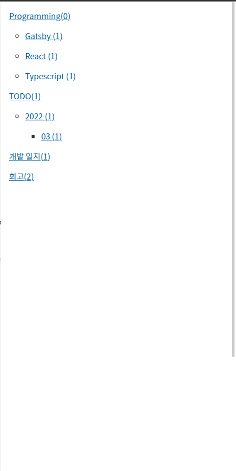
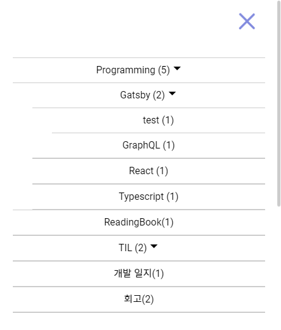
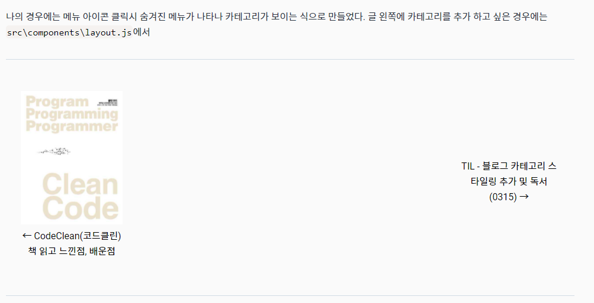

---

# 한 일
- 카테고리 스타일링 추가
- 이전글 다음글 부분에 이미지 추가
- Clean Code 책 읽기 시작

오늘은 카페에서 커피를 마시면서 힐링을 좀 많이 하느라 많은 작업을 하진 못했다.

## Category Styling

오늘은 많은걸 스타일링 하진 못했고 카테고리쪽 스타일링을 해 주었다.
기존에는 메인 페이지에나 글 상세보기 페이지에서 좌측에 카테고리에 fixed 스타일링을 추가해 스크롤해도 따라오는 식으로 해 주었었다.
메인페이지에는 포스트들을 Masonry Layout 형식으로 바꾸면서 전체적인 스타일이 어울리지 않다고 느껴 제거 했고,
글 상세보기 페이지에도 뭔가 어울리지 않다고 느껴 제거하였다. 그리고 메뉴 아이콘 클릭시 나오는 메뉴에다가 카테고리를 추가 해주었다.

위의 사진이 스타일링을 전혀 안해준 상태다. 이대로는 영 아니다 싶어 스타일링을 임시로 추가 해주었다. (아직 미완성)

아직 많이 조잡하긴 하지만 전보다는 나아졌다. 일단 우측에서 메뉴가 보이는 형식에 카테고리를 예쁘게 넣으려면 아코디언 형식으로 하는게 좋을것 같아서 적용시켰다.
전에는 각 상위 카테고리를 클릭하면 `/category/[category_name]` 형식으로 바로바로 가지게 해뒀는데 아코디언 메뉴로 바꾸면서 저 방식과는 어울리지 않아서
최하위에 있는 카테고리만 링크를 통해 `해당 카테고리 상세 페이지`로 갈 수 있도록 변경 해 주었다. 상세 페이지로 갈 수 있는 li와 아닌 li를 구분하기 위해
옆에 역삼각형의 아이콘을 추가 해 주었다. 추후 스타일링을 통해 좀 더 보기 좋게 수정할 예정이다.

## 이전글 다음글에 이미지 추가

전에 봤던 블로그에서 이전글 다음글 부분에 이미지가 포함이 되어 있던게 기억에 남아서 나도 한 번 추가해 보기로 했다.

위의 사진이 글 작성일 기준 1차 버전이다. 이미지만 추가하면 조금 나아질 줄 알았더니 크기 조정을 하지 않아 제멋대로고,
사진이 없는 글은 저렇게 되어 있어 좀 애매하다 싶었다. 일단 카테고리를 스타일링 먼저 하는게 나을것 같아 내일 하기로 미뤘다.

## Reading `Clean Code`

오늘은 사수분이 추천해준 `Clean Code` 라는 책을 앞부분만 읽어 보았다.
사실 글 작성일 기준 몇달 전에 회사에 같은 부서에 있던 다른분이 한번 추천해 준 적이 있었는데 그때도 잠깐 읽다 말았었다.
읽으면서 제일 기억에 남았던 부분은  

 - 깨끗한 코드란 한눈에 이해되는것, 한 함수에 한 기능이 되도록 짜는것, 의존성이 적은것 등등
 - 이름을 막 짓지 말고, 너무 줄여 쓰지 말고, 명확하게 해당 의미가 잘 전달되도록 이름을 짓자.
 - 말하기 쉬운 이름을 짓도록 노력하자.

정도가 기억에 남았다. 자세한 글은 따로 적어놓았다. [Clean Code](/ReadingBook/cleanCode/) (책을 다 읽을때까지 업데이트 예정)

---

# 마치며

지금 다니는 회사는 3월달까지는 여유가 남아 이렇게 블로그를 수정하고 개인 공부를 하지만,
4월달 부터는 슬슬 일이 생기기 시작하여 개인 공부를 지금처럼 할지 잘 모르겠다. 매일 조금씩이라도 하고 TIL을 올리도록 노력해야지.
