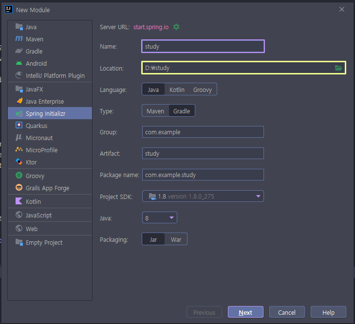
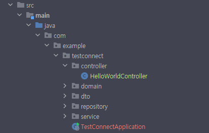
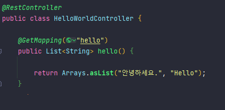

---

우리 회사에선 주로 spring을 사용하고 개인적으로는 React를 공부하고 있어 혹시나 나중에 같이 사용할까 싶어 같이 쓸 수 있는지 알아보았다.

---

# 참고 사이트

 - https://7942yongdae.tistory.com/136

위의 사이트를 주로 보면서 배웠다.

---

# 프로젝트 구성
 - Java: 1.8
 - Spring Boot 2.6.4
 - Gradle or Maven / Gradle 사용
 - React 17.0.2
 - IDE - Intellij

---

# 만드는 과정

1. 먼저 Spring Initializr 을 통해 Spring boot Project를 생성해주었다.(intellij 사용하였음)
2. MainController.java 를 생성 후 getMapping() 붙여준 후 실행되는지 테스트
3. react project 생성 (npx create-react-app) 및 package.json 속성 추가
4. build.gradle 속성 추가 및 build 테스트

대략 4개의 과정으로 나누었다.

## 1. Spring Boot Project 생성

나는 Intellij에서 프로젝트 생성 후 해당 프로젝트에서 모듈(Spring initializer) 을 통해 생성해주었다.



Spring Initializer을 통해 생성할 때
Name, Location, Group, Artifact, Package Name 등은 자유롭게 재량껏 정한다.
자바 버전은 1.8로 해 두었고, Type은 Gradle, Packaging은 Jar을 선택해주었다.

## 2. Controller 생성 및 테스트

[Name]Application.java 에 위치한 패키지에 Controller 패키지를 추가 해주고 그 안에 원하는 이름의 Controller.java를 생성해준다.



이름은 연결하기 위한 테스트라 간단하게 `testConnect`로 해주었다.
Controller이외의 패키지는 회원가입 기능을 테스트하기 위해 추가해둔것들이다.



보통 프론트단에 정보를 전달하기위한 컨트롤러에는 `@RestController`이란 어노테이션을 붙여준다.
`/hello` url로 접속시 배열 형태를 전달하기 위해 위에 사진의 형태로 만들었다.
다 작성 후 실행해서 `/hello` url로 접속하면 아래 사진처럼 나타날 것이다.


## 3. 리액트 프로젝트 생성

지금 만든 spring boot 프로젝트에서 터미널을 열고 `npx create-react-app frontend`을 입력한다.
typescript을 적용하고 싶으면 위 명령어 끝 부분에 `--typescript` 을 추가하면 된다. ( frontend 라는 이름 말고 다른 이름도 무관하다. )

### 3.1 Package.json 수정

frontend 디렉토리 안의 package.json으로 들어가서 상단에 (로컬기준) `"proxy": "http://localhost:8080"` 을 추가 해준다.
( 뒤의 포트는 spring boot에서 설정되어있는 포트와 같게 적으면 된다. )
```json
{
  "name": "frontend",
  "version": "0.1.0",
  "private": true,
  "proxy": "http://localhost:8080"
}

```
지금 이 설정을 하는 이유는 이후에 `npm start` 명령어를 통해 react 서버를 따로 실행 시켜서 fetch()를 통해 
spring boot 서버에서 값을 가져올 예정인데, `proxy` 설정을 해주지 않으면 가져올 수가 없다고 한다.
기본적으로 다른 도메인에서 값을 가져갈 수 없게 막아져 있는데 `proxy`란 설정이 그 막아져있는걸 해제해 주는거라고 알고 있다.
자세한 설명은 구글링을...

## 4. build.gradle 수정

이부분의 자세한 설명은 아직은 못하겠다. 나는 주로 spring boot를 쓴다면 Maven을 쓰고 있었고, Gradle 관련된걸 이번에 알게 되면서 공부중이다. ( - 변명 - )  
본론으로 들어와 아까 생성한 spring boot project에서 `build.gradle` 파일에 들어가서 맨 아랫부분으로가서 아래 코드를 그대로 넣어준다.

```groovy

def frontendDir = "$projectDir/frontend"

sourceSets {
    main {
        resources {
            srcDirs = ["$projectDir/src/main/resources"]
        }
    }
}

processResources {
    dependsOn "copyReactBuildFiles"
}

task installReact(type: Exec) {
    workingDir "$frontendDir"
    inputs.dir "$frontendDir"
    group = BasePlugin.BUILD_GROUP
    if (System.getProperty('os.name').toLowerCase(Locale.ROOT).contains('windows')) {
        commandLine "npm.cmd", "audit", "fix"
        commandLine "npm.cmd", "install"
    } else  {
        commandLine "npm", "audit", "fix"
        commandLine "npm", "install"
    }
}

task buildReact(type: Exec) {
    dependsOn "installReact"
    workingDir "$frontendDir"
    inputs.dir "$frontendDir"
    group = BasePlugin.BUILD_GROUP

    if (System.getProperty('os.name').toLowerCase(Locale.ROOT).contains('windows')) {
        commandLine "npm.cmd", "run-script", "build"
    } else {
        commandLine "npm", "run-script", "build"
    }
}

task copyReactBuildFiles(type: Copy) {
    dependsOn "buildReact"
    from "$frontendDir/build"
    into "$projectDir/src/main/resources/static"
}


```

`Gradle`은 지금 알고있는거로는 `Groovy`란 언어 기반으로 만들어져 있고, `Maven`처럼 자동으로 빌드를 도와주는 도구 라고 알고있다.
(`Groovy`란 JVM에서 실행되는 스크립트 언어 라고 한다.)  
위의 코드를 작성하는 이유로써는 간단하게 **스프링부트 프로젝트와 리액트 프로젝트를 합치기 위함** 라고 알면 될 것 같다. 
`build.gradle` 수정 전 기준으로 각각의 서버에서 테스트를 하는데 한 곳에서 테스트를 하기위함 + 추후에 배포를 위함인걸로 난 이해했다.
위 코드를 실행하게 되면 spring boot 프로젝트 디렉토리 기준으로 
`src/main/resources/static` 이란 디렉토리에 빌드된 리액트 프로젝트의 파일이 추가된다. 그리고 spring boot 프로젝트를 실행하게 되면
리액트 서버를 따로 실행하지 않아도 테스트를 할 수 있게 된다.

### 4.1 build Test

스프링 부트 프로젝트를 최상위 디렉터리 기준으로 cmd 창에 `./gradlew build` 명령어를 입력해보자.
그럼 cmd창에 막 뜨면서 끝날때 쯤 `src/main/resources/static` 폴더를 확인해보면 빌드된 리액트 프로젝트의 파일들이 들어있을것이다.

# 마치며

이제 스프링 부트 프로젝트를 실행하게 되면 자동으로
`React Project에서 필요한 module Install 및 build` -> `스프링 프로젝트의 static 폴더에 추가` ->
`스프링 부트 프로젝트 실행` 대략 이런 프로세스로 실행될것이다. 지금은 큰 흐름만 이해했고 추후에 gradle에 관련된 공부, 
왜 이렇게 동작되는지에 대한 공부를 할 예정이다.
