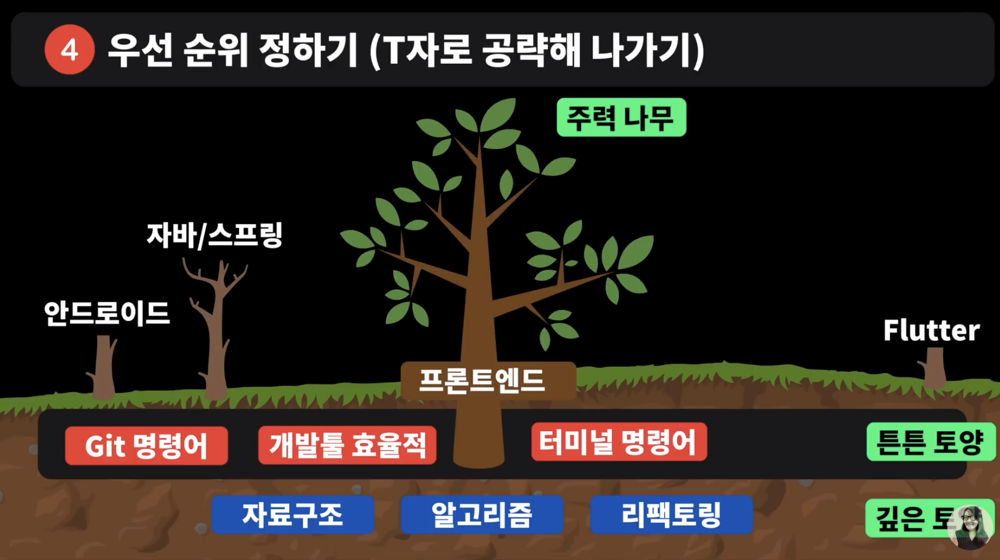
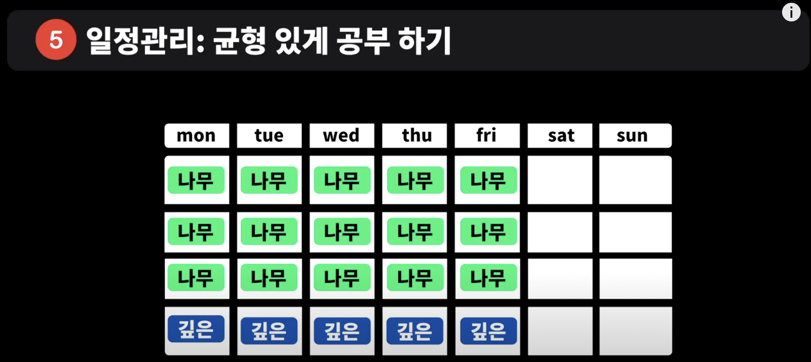
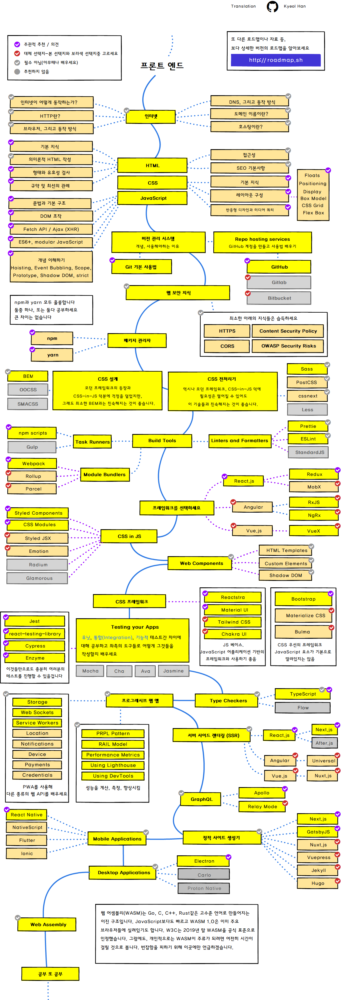

오늘은 유튜브 알고리즘에 떴던 드림코딩 엘리의 로드맵 관련 영상을 봤다.

1. 다음은 오지 않는다. ‘이번만, 다음에!’ 하지 않기
    1. 지금 직면 했을 때가 공부하기 제일 좋다
2. 깨어있가 ( 사고하기 )
    1. 하루 열심히 일한다고 해도, 실제로 열심히 생각하고 사고한 시간은 몇 분 안된다
        1. Ex)
        2. 궁극적인 목표가 무엇인지
        3. 왜 하는건지
        4. 왜 이렇게 되는건지
        5. 불편한데, 여기서 비효율적인걸 어떻게 개선 할 지
        6. 업무에 반복적으로 나타날 시 제대로 파헤쳐보기
3. 메모하기: 내가 필요한 지식들 정리하기
    1. Ex ) 노트, 앱 등에 정리 후 블로그 하는것에 추천
4. 우선 순위 정하기 ( T자로 공략해 나가기 )
    1. 스프링이나 안드로이드 등으로 공부 하다가 프론트 엔드를 하고 싶다고 하면 프론트 엔드 위주로 무엇이 필요한지 알아보고 하나하나 공부해나가기
    2. 직접적으로 영향이 가는 / 개발 업무에 실질적 영향이 있고 / 업무 생산성 효율이 높아지는 튼튼 토양
        1. Git 명령어, 개발툴 효율적, 터미널 명령어 효율적 사용
    3. 직접적/ 실직적이진 않지만 은은하고, 딥한 개발자가 되기 위한 깊은 토양
        1. 자료구조, 알고리즘, 리팩토링
5. 일정관리: 균형 있게 공부하기
    1. 모든걸 한 번에 공부하려고 하면 매우 힘들다
    2. 한 번에 안하고 오래 공부해나가는 사람의 기준으로
        1. 한 달 기준으로 이 번달의 1주차, 2주차, 3주차는 나무(프론트 엔드 나무면 react, js 등등)를 공부한다.
        2. 마지막 주는 깊은 토양 관련된 공부를 한다

 

웹 개발 로드맵 등 이렇게 마인드 맵을 그려나가겨먼서 어떤것이 부족한지 주기적으로 확인해보는 것 추천

 

로드맵을 보면서 생각보다 부족한 점이 많다고 느꼈다. 하나하나 보면서 설명한다고 생각하고 생각해보려고 해보니 생각보다 답이 잘 안나왔다.
지금은 리액트 사이드 프로젝트를 하고 있어 리액트 주변으로 하나하나 공부 해보고, 나중에 시간적인 여유가 된다면 위에서부터 하나하나
차근차근 공부해 볼 생각이다.

