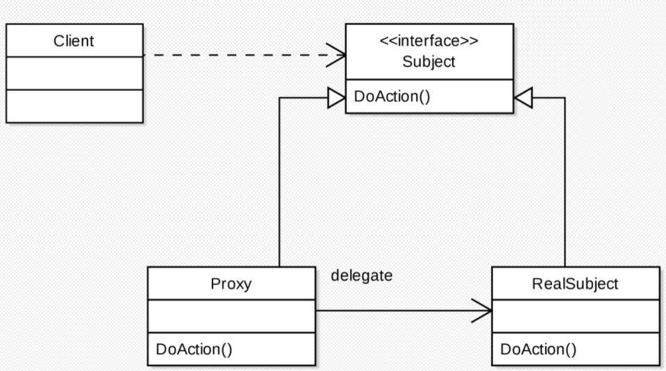

## 프록시 패턴(Proxy Pattern) 이란?

프록시 패턴을 설명하기에 앞서, 먼저 Proxy(프록시)란 대리자, 대변인의 뜻을 가지고 있다.  
대리자란 누군가를 대신에 특정 일을 수행하는 존재로서, 프록시 패턴(Proxy Pattern)도 이 의미와 비슷하다.  
  
프록시 패턴(Proxy Pattern)은 예를 들어, A 객체를 사용하고자 할 때, A 객체를 직접 참조하여 사용하는 것이 아닌, A 객체를 대항하는
B 객체를 통해 대상 객체에 접근하는 방식을 말한다.  
  
해당 방식을 사용하면 A 객체가 메모리에 존재하지 않아도, 기본적인 정보를 참조하거나 설정할 수 있고,  
실제 객체의 기능을 실행하기 전 후에 다른 기능을 추가할 수 있다.


출처: 위키백과

## 예제
```java
// subject
interface RoadViewService {
    public void displayView();
}

// RealSubject
class RealRoadViewService implements RoadViewService {
    @Override
    public void displayView() {
        System.out.println("road view...");
    }
}
```

```java
//Proxy
class RoadViewServiceProxy implements RoadViewService {
    RealNavigation navigation;
    
    public RoadViewServiceProxy() {
        this.navigation = new RealNavigation();
    }

    @Override
    public void displayView() {
        System.out.println("트랜잭션...");
        navigation.displayView();
        System.out.println("로깅...");
    }
}
```

```java
//client
public class Client {
    RoadViewService roadViewService = new RoadViewServiceProxy();
    roadViewService.displayView();
}
```
 - Client = Client (class)
 - Subject = RoadViewService (interface)
 - Proxy = RoadViewServiceProxy (class)
 - ReadlSubject = RealRoadViewService (class)

## 마치며
어렵지 않으면서 약간 어려운 개념이다. 몇 번 반복 및 활용을 해본다면, 익숙해질 것 같다.

> ※ 추 후 데코레이터 패턴에 대해 다룰 예정이다.
