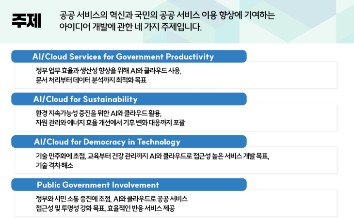
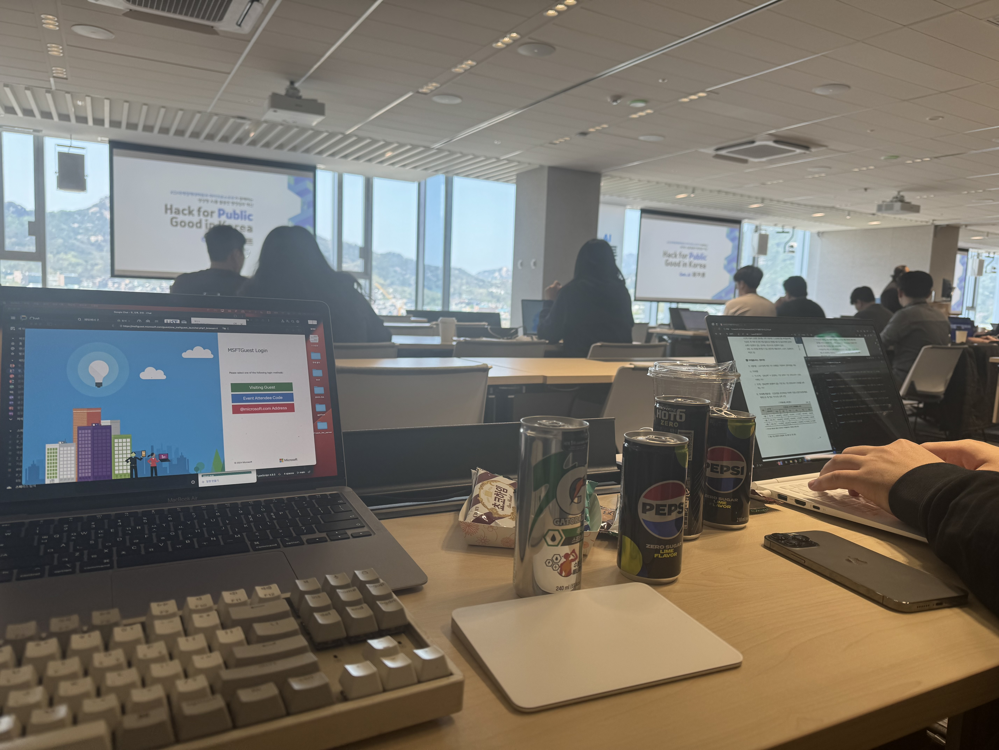
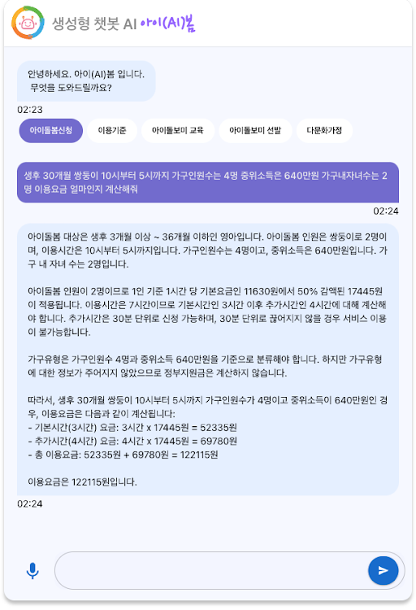
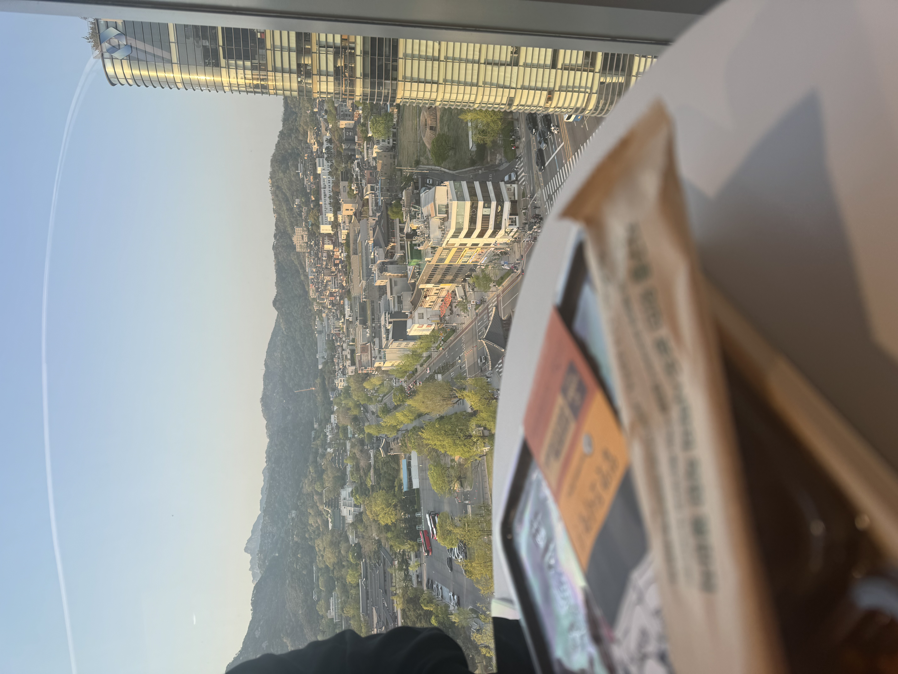

## 목차
- 참여 계기
- 행사장에 들어가며
- 해커톤 시작하기에 앞서 MS Azure 강의
- 개발 시작

## 참여 계기
평소처럼 회사에서 업무를 진행하던 날, 한 회사 직원분이 나에게 재밌는 해커톤이 하나 있는데 참가하는건 어떻냐고 제안을 했다. ( 해커톤 소개 페이지를 보니 되게 재밌어 보였다. )  
주제는 "**공공 서비스의 혁신과 국민의 공공 서비스 이용 향상에 기여하는 아이디어 개발**" 이였다.

  
주제를 보고 어떤걸 만들어야 할까 고민하던 찰나, 제안했던 직원분이 그건 걱정할 필요 없다고 하셨다.  
어떤걸 만들지는 정해져 있었고, 여가부쪽에서 새로 시작하려는 사업과 관련이 있는데 실제 가능성이 있다는걸 보여주는게 목적이라 하셨다.  
만드는 기술스택은 원히는대로 사용해도 된다고 하여, 총 "**기획자 2, AI 엔진미어 1, 개발자 1(나)**"로 구성해 어쩌다보니 혼자 풀스택으로 담당해 해커톤에 참여하기로 결정되었다...

> 행사 링크: https://event-us.kr/aiinnovation/event/80730  

---

## 행사장에 들어가며
  
마이크로소프트와 연계된 해커톤이라 그런지 사람이 꽤 많았다.. ( 듣기로는 25..? 30팀쯤이 참가했다고 했었다. )  
본격적으로 시작하기 앞서 빠르게 개발을 하기 위해 환경 세팅을 미리 해두고, 팀 빌딩을 시작했다.  
( 각 팀의 목적을 발표하였고, 개인 참가의 경우 팀을 꾸리고 싶은지, 어떤 팀에 참가하고 싶은지에 대한 발표가 이루어졌고,  
위의 과정을 통해 팀 빌딩이 이루어졌다.)

### 개발 환경

**Client**
- React 18.x + TypeScript
- UI Library: MUI
- axios

**Backend**
- Spring boot 5.x ( REST API Server로 사용 )
- MS Azure SDK  
  
시연은 시연자의 노트북을 사용하여 진행하기에 로컬환경이면 충분할 듯 싶어, 배포환경은 세팅하지 않았다.

---

## 해커톤 시작하기에 앞서 MS Azure 강의
해커톤을 시작하기에 앞서, MS Azure를 먼저 활용하는 방법에 대한 강의가 이루어졌다.
MS Azure에 접속하여
- 어떻게 클라우드 환경을 만드는지,
- chatGPT 모델을 어떻게 가져와서 사용하는지에 대한 기초 강의  
  
등을 진행하였고, 이후 바로 해커톤이 본격적으로 시작되었다.  
> 나의 경우 AI쪽 지식이 많지 않아 흥미롭게 들을 수 있었고,   
> 꼭 이게 아니더라도 AI를 잘 사용하여 개인 서비스 개발 및 개인 블롣그에도 적용할 수 있겠다는 생각이 들었다.

---

## 우리 팀 주제 
**생성형 AI를 기반으로한 아이돌봄 챗봇 서비스 구현**
  
실제 정부에서 운영중인 아이돌봄 서비스에서, 신청 절차를 잘 모르겠고 번거롭고 잘 활용을 못하겠다는 사용자의 피드백이 있었다.    
기존의 방식으로 만들어진 챗봇 서비스 만으로는 사용자의 니즈를 충족하기가 어려워서, 생성형 AI를 도입한 아이돌봄 서비스의 가능성을 알리기 위해,
데모 서비스의 느낌으로 개발을 진행하게 되었다.

---

### 기능 구현 목록
- GPT 4를 기반으로 한 테이블 데이터 인식을 활용하여 답변 제공
- 아이돌봄 긴급 지원 서비스를 신청하기 위한 비용 자동 계산
- TTS 기술을 활용한 음성 챗봇 서비스 기능 구현

---

## 개발 시작

먼저 필요한 기능들을 기획자분들과 상의하여 리스트업 하고, 그거에 맞게 필요한 Backend API 개발을 먼저 진행했다.  
그동안 다른 한 분은 AI 데이터에 활용할 데이터를 MS Azure를 활용해 넣어주는 작업을 진행했고,  
기획자 분은 발표 준비를 위한 PPT를 사전에 만들기 시작했다.

Backend 개발의 경우 MS Azure의 GPT하고 통신하기 위한 설정과, 실제로 응답이 잘 되는지에 대한 테스트를 진행했다.  

Front 개발의 경우, MUI를 사용해서 디자인하는 시간을 최대한 줄이고, 템플릿은 Pinterest를 참고하여 비슷하게 만드는 방향으로 진행을 했다.
  
챗봇 관련 컴포넌트는 이미 만들어본 경험이 있어 틀을 만들기까지는 몇 시간 걸리지 않았고, API와 연동하고 생각하지 못한 문제를 만나면서 고치기까지가 꽤 걸렸다.

---

## 개발 도중 에러사항

### Strem 형태로 받아온 데이터를 클라이언트에서 예쁘게 보여주지 못하는 현상
Backend API에서 stream형태로 챗봇 메세지를 받아오도록 구현했고,
Client에서 데이터를 즉각적으로 받아오는것 까진 문제가 없었으나, 받아오는 족족 state를 업데이트를 시도하고 -> 해당 값을 토대로 타이핑 애니메이션 컴포넌트에 반영을 했으나,
애니메이션이 정상적으로 동작하지 않고 한 번에 생겨버리는 문제가 발생했다.   
-> 원인 분석을 제대로 하고 싶었으나 해커톤의 특성상 짧은 시간안에 만들어야 했기에, Stream 방식은 포기하고 post 형식으로 데이터를 가져오도록 수정 후, 타이핑 애니메이션을 적용시켜 문제를 임시로 해결했다.

### GPT 역질문 기능 이용한 신청서 자동 작성 기능
기획자분이 원했던 기능 중 하나는 GPT의 역질문을 통해 얻은 답변을 토대로 한글 파일을 작성해서 제출하는 기능을 원했었다.  
하지만 GPT 자체가 역질문을 해준다 한들 어떤 질문을 할지, 어떤거에 대한 답을 얻을건지 개발자의 관점에서 예측하기 어렵고 그걸 토대로 작성하는 기능을 만들기란 현재로선 어렵다고 판단했다.  

그래서 GPT가 역질문을 해주는 것 처럼 보이도록 특정 키워드에 한해 정해진 질문이 나가고   
-> 해당 질문을 토대로 Spring 환경에서 한글 파일을 작성하고 다운로드까지 되도록 기능 구현을 했다.

---

## 결과

본선 진출을 위한 4팀 정도 뽑는 과정을 진행했다.  
그래도 나름 뽑힐 줄 알았는데.. 아쉽게도 본선 진출까진 가지는 못했다..  
> 분명 우리보다도 잘했고, 퀄리티도 높고 아이디어도 참신했다고 느꼈던 팀들이 꽤 있었는데, 이런 팀들도 전부 떨어지는걸 보고 의아함을 느꼈다.

---

## 아쉬웠던점

### GPT API 응답 형식을 markdown으로..
막상 GPT를 활용한 채팅 기능을 만들다 보니, "ChatGPT나 Wrtn은 채팅을 되게 예쁘게 보여주는데, 현재는 일반 텍스트만 보여주니까 밋밋하다"라는 느낌을 받았었다.
해커톤이 끝나고 ChatGPT / Wrtn을 조사해보니, markdown 형태로 답변을 받도록 한다는 것을 알게 되었다.   
이걸 사전에 알았더라면 충분히 구현 가능한 기능이였고 사용자 가독성 측면에서도 훨씬 좋고, 시연할 때도 좀 더 높은 점수를 받을수 있지 않았을까 하는 아쉬움이 들었다.

현재 우리 회사에서 AI를 활용한 챗봇 서비스를 운영중이여서 이에 대한 내용을 수석님께 전달드린 후
-> 개발을 진행해서 적용시키는 작업까지 진행했다.  

---

## 마치며
비록 수상은 못했어도 이번 해커톤을 통해 여러 아이디어와 AI의 활용성에 대한 정보를 얻었고, 그걸 자사 서비스에 적용시키는 것만으로도 얻은건 꽤 있다고 생각했다.

그래도 멋진 풍경을 보며 저녁은 맛있었다..!
