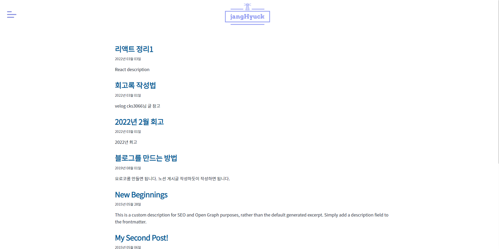
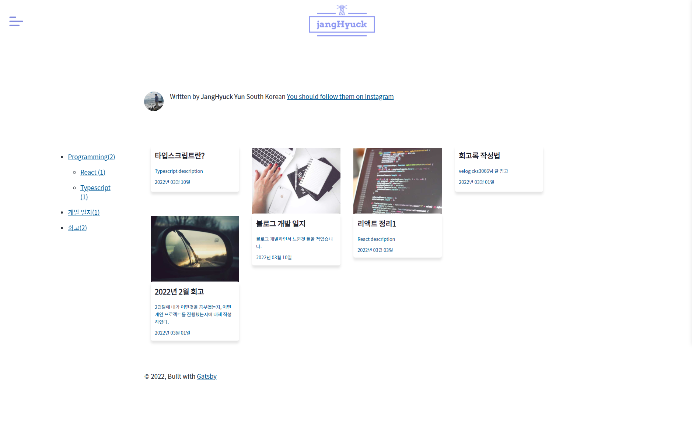

# 블로그를 개발 하기까지

지금까지 내가 공부한 것들을 계속 쓰지 않다보면 까먹는게 아까워서 블로그를 쓰기로 다짐 했었다.  
나중에 해야지 하면서 계속 미뤘었지만 친구는 **vue**를 이용해 블로그를 만들기 시작하였고, 회사분들하고 카페에서 얘기하면서
정리의 중요성을 계속 깨닫게 되면서 더이상 미루지 말고 만들기로 하였다.  
어떤 언어로 개발할지 정하는건 그리 어렵지 않았다. 지금 **리액트 라이브러리**를 공부중이여서 리액트로 만들기로 결정 하였고,  
리액트로 블로그를 좀 더 간편하게 만드는법을 찾던중 **Gatsby** 라는 **리액트 기반의 정적 생성기 사이트** 라는 것을 알게 되었다.  

> [Gatsby란?](/Programming-language/Javascript/Gatsby/Gatsby란/) \
> ※ 추후 Gatsby 관련해 내용 정리할 예정

Gatsby 플러그인 중에 `gatsby-starter-blog` 플러그인을 이용해 빌드 후 안의 내용을 바꿔가며 블로그를 만들었다.  

---

# Gatsby로 블로그를 개발하면서

Gatsby에도 테마였나 템플릿을 선택하여 자동으로 만들 수 있다.

> [내가만든 Gatsby 블로그 구조](https://naver.com)

## 테마? 템플릿?

템플릿을 이용하여 만들까 했지만 처음 만들어보는 블로그이다 보니 직접 꾸미면서 만들어 보고 싶어 커스텀으로 만들게 되었다.

## 느낀점

**React**를 좀 안다고 바로 **Gatsby**를 자유자재로 커스텀하면서 블로그를 만들거란 생각은 하지 말았어야 했다.  
하나를 고치면 여러 에러가 발생하고 `수정->에러->수정->에러`의 무한 굴레에 빠져버려 이대로는 안되겠다 싶었다.  
**Gatsby**의 공식 문서를 보면서 공부하는 것도 좋은 방법이지만, 아직 나는 **다른 사람들이 만드는 방식을 보고 적용**시키는게 편해서
다른 사람들이 어떤식으로 만들었는지 보고 비슷하게 적용시켰다.  

위에 사진은 첫번째로 빌드 된 후의 모습이다.  
헤더 부분은 수정했고, 메인 콘텐츠 영역은 플러그인 설치 후에 자동으로 적용되는 기본 템플릿이다.  
이대로는 너무 밋밋하다 싶어 Masonry Layout 형식으로 바꾸었다.

위에 사진은 메인 콘텐츠 영역에 Masonry Layout을 최종으로 적용시킨 모습이다.   
Masonry 레이아웃을 적용시키기 전에는 `flex`속성에 `flex-wrap:wrap` 속성으로 정렬만 하려고 했는데, 이미지가 없는 글은
크기가 이미지가 있는 레이아웃 보다 작아 약간 깨지게 보였다.
`Masonry Layout 적용 전인 flex속성을 활용해 정렬한 사진은 다시 고치기 귀찮아서 올리지 않았다.`  
옆의 부분에 카테고리를 추가하면 좋을거 같아 추가해보았다.

### Category

카테고리는 그냥 적용법을 구글링 후 그대로 적용시키면 잘 될줄 알았더니 내 입맛에 맞게 바꾸려 하다 보니 에러가 은근 많이 났었다.  
**Gatsby**에 카테고리 추가하는법에 관련해서 구글링 중 **typescript**로 적용한 사람의 글을 참고하여 추가하였다.  

> [Gatsby에 category 추가하는 법](https://naver.com)

### 목차

velog의 글을 보다 오른쪽에 목차가 따라오는걸 보고 내 블로그에도 저런 기능을 추가하면 좋을것 같아 추가하였다.  
현재 스크롤 위치에 따라 목차에 active 효과를 주고 싶었지만 당시에는 목차를 추가하고 카테고리 기능을 만들기에 바빠
나중으로 미루다 보니 결국 active 효과를 제외한 나머지 기능만 만들게 되었다. `추후 스크롤 위치에 따른 active 효과를 줄 예정이다.`  

> [Gatsby에 목차 추가하는 법](https://naver.com)

---

# 마치며

블로그 디자인은 계속 수정해 나갈 예정입니다.  
지금까지 긴 글을 봐주셔서 감사합니다. **아직 쓰기 시작한지 얼마 되지 않아** 틀린 맞춤법이 있을수도 있고 내용이 왔다갔다 할 수 있습니다.  
**읽는맛이 있게 쓰드록** 노력하겠습니다~

